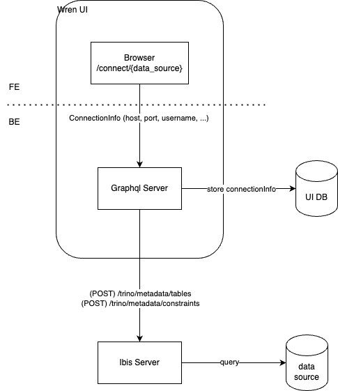
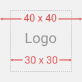

# Contributing Guidelines

*Pull requests, bug reports, and all other forms of contribution are welcomed and highly encouraged!* :octocat:

### Contents

- [Code of Conduct](#book-code-of-conduct)
- [Overview](#mag-overview)
- [Contribution Guide of Different Services](#love_letter-contribution-guide-of-different-services)
- [Creating a New Data Source Connector](#electric_plug-creating-a-new-data-source-connector)

> **This guide serves to set clear expectations for everyone involved with the project so that we can improve it together while also creating a welcoming space for everyone to participate. Following these guidelines will help ensure a positive experience for contributors and maintainers.**

## :book: Code of Conduct

Please review our [Code of Conduct](https://github.com/Canner/WrenAI/blob/main/CODE_OF_CONDUCT.md). It is in effect at all times. We expect it to be honored by everyone who contributes to this project. Acting like an asshole will not be tolerated.


## :rocket: Get Started
1. Visit [How Wren AI works?](https://docs.getwren.ai/oss/overview/how_wrenai_works) to understand the architecture of Wren AI
1. After you understand the architecture of Wren AI, understand the scope of the services you want to contribute to.
  Check each service's section under [Contribution Guide of Different Services](#love_letter-contribution-guide-of-different-services) to learn how to contribute to each service.
    1. If you are dealing with UI-related tasks, such as adding a dark mode, you only need to contribute to the [Wren UI Service](#wren-ui-service).
    2. If you are dealing with LLM-related tasks, such as enhancing the prompts used in the LLM pipelines, you only need to contribute to the [Wren AI Service](#wren-ai-service).
    3. If you are working on data-source-related tasks, such as fixing a bug in SQL server connector, you will need to contribute to the [Wren Engine Service](#wren-engine-service).
1. If you are not sure which service to contribute to, please reach out to us in [Discord](https://discord.gg/canner) or [GitHub Issues](https://github.com/Canner/WrenAI/issues).
1. It's possible that you need to contribute to multiple services. For example, if you are adding a new data source, you will need to contribute to the [Wren UI Service](#wren-ui-service) and [Wren Engine Service](#wren-engine-service). Follow [Guide for Contributing to Multiple Services](#guide-for-contributing-to-multiple-services) to learn how to contribute to multiple services.

## :love_letter: Contribution Guide of Different Services

### Wren AI Service

Wren AI Service is responsible for LLM-related tasks like converting natural language questions into SQL queries and providing step-by-step SQL breakdowns.

To contribute to Wren AI Service, please refer to the [Wren AI Service Contributing Guide](https://github.com/Canner/WrenAI/blob/main/wren-ai-service/CONTRIBUTING.md)


### Wren UI Service

Wren UI is the client service of WrenAI. It is built with Next.js and TypeScript. 
To contribute to Wren UI, you can refer to the [WrenAI/wren-ui/README.md](https://github.com/Canner/WrenAI/blob/main/wren-ui/README.md) file for instructions on how to set up the development environment and run the development server.


### Wren Engine Service
Wren Engine is the backbone of the Wren AI project. The semantic engine for LLMs, bringing business context to AI agents.

To contribute, please refer to [Wren Engine Contributing Guide](https://github.com/Canner/wren-engine/blob/main/ibis-server/docs/CONTRIBUTING.md)

## Guide for Contributing to Multiple Services
We rely on docker-compose to start all services. If you are contributing to multiple services, you could just comment out the services you'd like to start from the source code and change the `env` variables to point to the services you started by yourself.

### Example: Contributing to the [Wren UI Service](#wren-ui-service) and [Wren Engine Service](#wren-engine-service)
If you are contributing to both the [Wren UI Service](#wren-ui-service) and [Wren Engine Service](#wren-engine-service), you should comment out the `wren-engine` service in the `docker/docker-compose-dev.yml` file (note that the UI service is already excluded from `docker/docker-compose-dev.yml`). Then, adjust the environment variables in your `.env` file to point to the services you have started manually. This will ensure that your local development environment correctly interfaces with the services you are working on.

1. Prepare your `.env` file: In the `WrenAI/docker` folder, use the `.env.example` file as a template. Copy this file to create a `.env.local` file.
    ```sh
    # assuming the current directory is wren-ui
    cd ../docker
    cp .env.example .env.local
    ```
2. Modify your `.env.local` file: Fill in the `LLM_OPENAI_API_KEY` and `EMBEDDER_OPENAI_API_KEY` with your OpenAI API keys before starting.
3. In the `WrenAI/docker` folder, copy `config.example.yaml` to `config.yaml` for AI service configuration. Also change `http://wren-ui:3000` to `http://host.docker.internal:3000` in `config.yaml`.
4. Start the UI and engine services from the source code.
5. Update the `env` variables in the `.env.local` file to point to the services you started manually.
6. Start the other services using docker-compose:
    ```sh
    # current directory is WrenAI/docker
    docker-compose -f docker-compose-dev.yaml --env-file .env.example up

    # you can add the -d flag to run the services in the background
    docker-compose -f docker-compose-dev.yaml --env-file .env.example up -d
    # to stop the services, use
    docker-compose -f docker-compose-dev.yaml --env-file .env.example down
    ```
7. Happy coding!

## :electric_plug: Creating a New Data Source Connector

To develop a new data source connector, you'll need to modify both the front-end and back-end of the Wren UI, in addition to the Wren Engine.

Below is a brief overview of a data source connector:



The UI is primarily responsible for storing database connection settings, providing an interface for users to input these settings, and submitting them to the Engine, which then connects to the database.

The UI must be aware of the connection details it needs to retain, as specified by the Engine. Therefore, the implementation sequence would be as follows:


- Engine:
  - Implement the new data source (you'll determine what connection information is needed and how it should be passed from the UI).
  - Implement the metadata API for the UI to access.
- UI:
  - Back-End:
    - Safely store the connection information.
    - Provide the connection information to the Engine.
  - Front-End:
    - Prepare an icon for the data source.
    - Set up the form template for users to input the connection information.
    - Update the data source list.

### Wren Engine

- To implement a new data source, please refer to [How to Add a New Data Source](https://github.com/Canner/wren-engine/blob/main/ibis-server/docs/how-to-add-data-source.md).
- After adding a new data source, you can proceed with implementing the metadata API for the UI.

  Here are some previous PRs that introduced new data sources:
    - [Add MSSQL data source](https://github.com/Canner/wren-engine/pull/631)
    - [Add MySQL data source](https://github.com/Canner/wren-engine/pull/618)
    - [Add ClickHouse data source](https://github.com/Canner/wren-engine/pull/648)

### Wren UI Guide

We'll describe what should be done in the UI for each new data source. 

If you prefer to learn by example, you can refer to this Trino [issue](https://github.com/Canner/WrenAI/issues/492) and [PR](https://github.com/Canner/WrenAI/pull/535).


#### BE
1. Define the data source in `wren-ui/src/apollo/server/dataSource.ts`
  - define the `toIbisConnectionInfo` and `sensitiveProps` methods

2. Modify the ibis adaptor in `wren-ui/src/apollo/server/adaptors/ibisAdaptor.ts`
  - define an ibis connection info type for the new data source
  - set up the `dataSourceUrlMap` for the new data source

3. Modify the repository in `wren-ui/src/apollo/server/repositories/projectRepository.ts`
  - define the wren ui connection info type for the new data source 

4. Update the graphql schema in `wren-ui/src/apollo/server/schema.ts` so that the new data source can be used in the UI 
  - add the new data source to the `DataSource` enum

5. Update the type definition in `wren-ui/src/apollo/server/types/dataSource.ts`
  - add the new data source to the `DataSourceName` enum

#### FE
1. Prepare the data source's logo:
   - Image size should be `40 x 40` px
   - Preferably use SVG format
   - Ensure the logo is centered within a `30px` container for consistent formatting

   Example:

   

2. Create the data source form template:
   - In `wren-ui/src/components/pages/setup/dataSources`, add a new file named `${dataSource}Properties.tsx`
   - Implement the data source form template in this file

3. Set up the data source template:
   - Navigate to `wren-ui/src/components/pages/setup/utils` > `DATA_SOURCE_FORM`
   - Update the necessary files to include the new data source template settings

4. Update the data source list:
   - Add the new data source to the `DATA_SOURCES` enum in `wren-ui/src/utils/enum/dataSources.ts`
   - Update relevant files in `wren-ui/src/components/pages/setup/` to include the new data source
   - Ensure `wren-ui/src/apollo/server/adaptors/ibisAdaptor.ts` handle the new data source

5. Test the new connector:
   - Ensure the new data source appears in the UI
   - Verify that the form works correctly
   - Test the connection to the new data source

