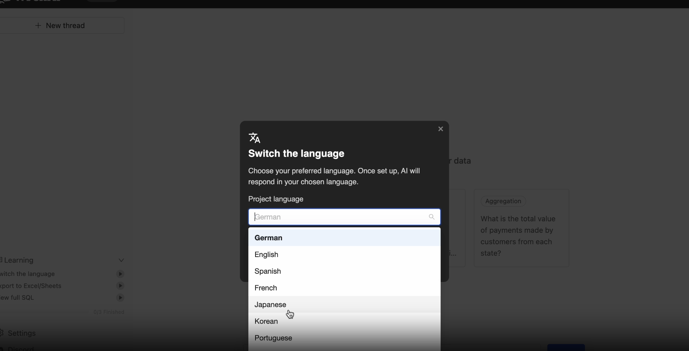
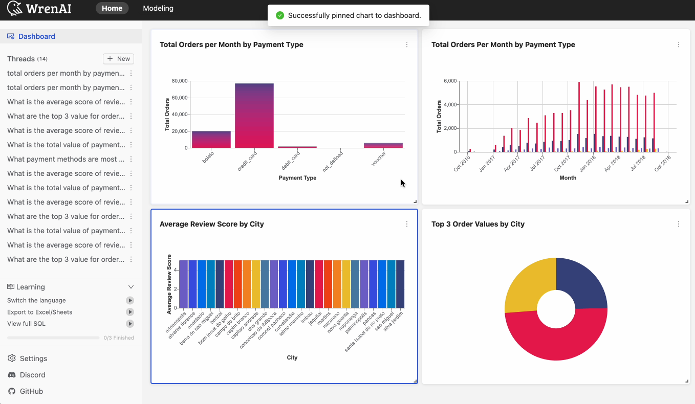
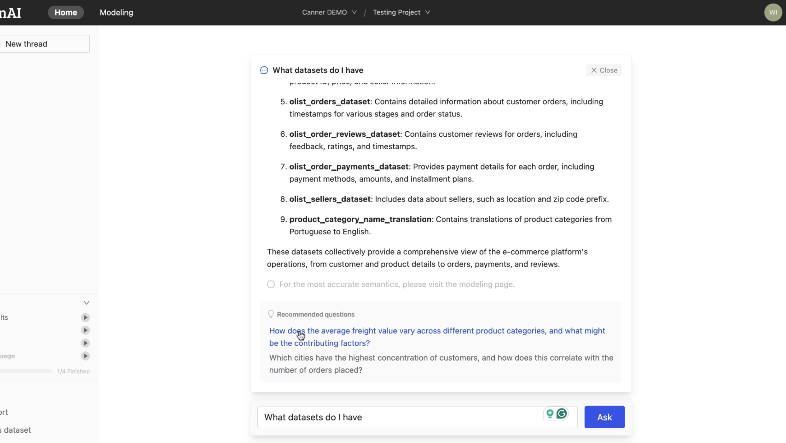
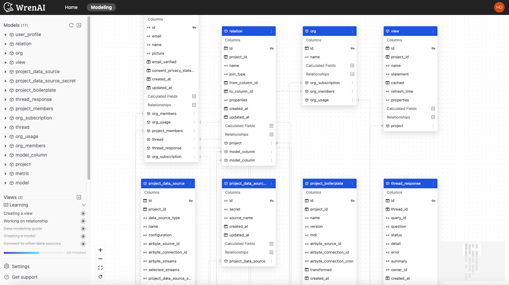
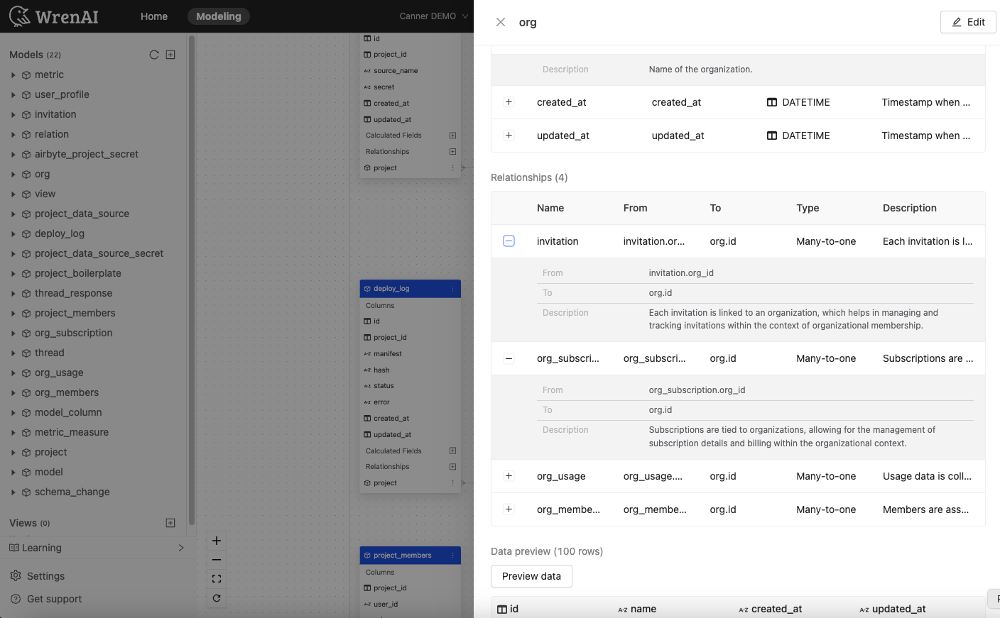
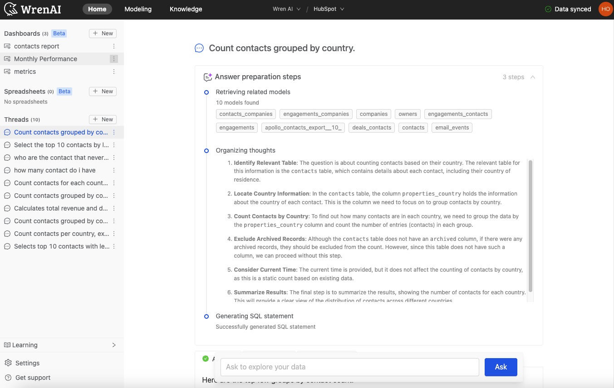
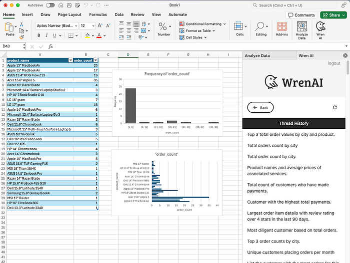
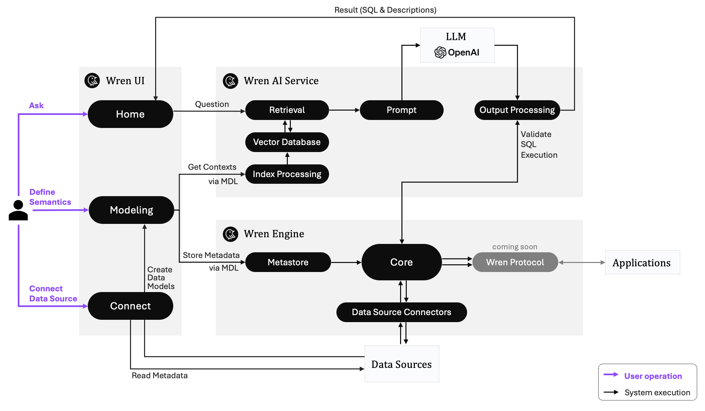

  <a href="https://getwren.ai/?utm_source=github&utm_medium=title&utm_campaign=readme">
    <picture>
      <source media="(prefers-color-scheme: light)" srcset="./misc/wrenai_logo.png">
      
    </picture>
    <h1 align="center">Wren AI</h1>
  </a>

  
  
  
  
  

  

> Open-source GenBI AI Agent that empowers data-driven teams to chat with their data to generate Text-to-SQL, charts, spreadsheets, reports, and BI. 

  

## 🕶 Try it yourself!

### GenBI (Generative Business Intelligence)

[Watch GenBI Demo](https://github.com/user-attachments/assets/90ad1d35-bb1e-490b-9676-b29863ff090b)

### Ask any questions

[Watch Demo](https://github.com/user-attachments/assets/e4e78006-0088-4094-b58f-8868689bf787)

👉 Try with your data on [Wren AI Cloud](https://getwren.ai/?utm_source=github&utm_medium=content&utm_campaign=readme) or [Install in your local environment](https://docs.getwren.ai/oss/installation/?utm_source=github&utm_medium=content&utm_campaign=readme)

## Supported LLM Models

Wren AI supports integration with various Large Language Models (LLMs), including but not limited to:
- OpenAI Models
- Azure OpenAI Models
- DeepSeek Models
- Google AI Studio – Gemini Models
- Vertex AI Models (Gemini + Anthropic)
- Bedrock Models
- Anthropic API Models
- Groq Models
- Ollama Models
- Databricks Models

Check [configuration examples here](https://github.com/Canner/WrenAI/tree/main/wren-ai-service/docs/config_examples)!

> [!CAUTION]
> The performance of Wren AI depends significantly on the capabilities of the LLM you choose. We strongly recommend using the most powerful model available for optimal results. Using less capable models may lead to reduced performance, slower response times, or inaccurate outputs.

## 🎯 Our Vision & Mission

At Wren AI, our mission is to revolutionize business intelligence by empowering organizations with seamless access to data through Generative Business Intelligence (GenBI). We aim to break down barriers to data insights with advanced AI-driven solutions, composable data frameworks, and semantic intelligence, enabling every team member to make faster, smarter, and data-driven decisions with confidence.

🤩 [Learn more about GenBI](https://getwren.ai/genbi?utm_source=github&utm_medium=content&utm_campaign=readme)

## 🤖 A User-Centric, End-to-End Open-source SQL AI Agent - Text-to-SQL Total Solution

### 1. Talk to Your Data in Any Language

> Wren AI speaks [your language](https://docs.getwren.ai/oss/guide/settings/pj_settings#change-project-language?utm_source=github&utm_medium=content&utm_campaign=readme), such as English, German, Spanish, French, Japanese, Korean, Portuguese, Chinese, and more. Unlock valuable insights by asking your business questions to Wren AI. It goes beyond surface-level data analysis to reveal meaningful information and simplifies obtaining answers from lead scoring templates to customer segmentation.

  

### 2. GenBI Insights

> The GenBI feature empowers users with AI-generated summaries that provide key insights alongside SQL queries, simplifying complex data. Instantly convert query results into AI-generated reports, charts, transforming raw data into clear, actionable visuals. With GenBI, you can make faster, smarter decisions with ease.

  

### 3. AI-powered Data Exploration Features

> Beyond just retrieving data from your databases, Wren AI now answers exploratory questions like “What data do I have?” or “What are the columns in my customer tables?” Additionally, our AI dynamically generates recommended questions and intelligent follow-up queries tailored to your context, making data exploration smarter, faster, and more intuitive. Empower your team to unlock deeper insights effortlessly with AI.

  

### 4. Semantic Indexing with a Well-Crafted UI/UX

> Wren AI has implemented a [semantic engine architecture](https://www.getwren.ai/post/how-we-design-our-semantic-engine-for-llms-the-backbone-of-the-semantic-layer-for-llm-architecture/?utm_source=github&utm_medium=content&utm_campaign=readme) to provide the LLM context of your business; you can easily establish a logical presentation layer on your data schema that helps LLM learn more about your business context.

  

### 5. Generate SQL Queries with Context

> With Wren AI, you can process metadata, schema, terminology, data relationships, and the logic behind calculations and aggregations with [“Modeling Definition Language”](https://docs.getwren.ai/oss/engine/concept/what_is_mdl/?utm_source=github&utm_medium=content&utm_campaign=readme), reducing duplicate coding and simplifying data joins.

  

### 6. Get Insights without Writing Code

> When starting a new conversation in Wren AI, your question is used to find the most relevant tables. From these, LLM generates the most relevant question for the user. You can also ask follow-up questions to get deeper insights.

  

### 7. Easily Export and Visualize Your Data

> Wren AI provides a seamless end-to-end workflow, enabling you to connect your data effortlessly with popular analysis tools such as [Excel](https://docs.getwren.ai/oss/guide/integrations/excel-add-in/?utm_source=github&utm_medium=content&utm_campaign=readme) and [Google Sheets](https://docs.getwren.ai/oss/guide/integrations/google-add-on/?utm_source=github&utm_medium=content&utm_campaign=readme). This way, your insights remain accessible, allowing for further analysis using the tools you know best.

  

## 🤔 Why Wren AI?

We focus on providing an open, secure, and accurate SQL AI Agent for everyone.

### 1. Turnkey Solution

> Wren AI makes it easy to onboard your data. Discover and analyze your data with our user interface. Effortlessly generate results without needing to code.

### 2. Secure SQL Generation

> We use RAG architecture to leverage your schema and context, generating SQL queries without requiring you to expose or upload your data to LLM models.

### 3. Open-source End-to-end Solution

> Deploy Wren AI anywhere you like on your own data, LLM APIs, and environment, it's free.

## 🤖 Wren AI Text-to-SQL Agentic Architecture

Wren AI consists of three core services:

- ***[Wren UI](https://github.com/Canner/WrenAI/tree/main/wren-ui):*** An intuitive user interface for asking questions, defining data relationships, and integrating data sources.

- ***[Wren AI Service](https://github.com/Canner/WrenAI/tree/main/wren-ai-service):*** Processes queries using a vector database for context retrieval, guiding LLMs to produce precise SQL outputs.

- ***[Wren Engine](https://github.com/Canner/wren-engine):*** Serves as the semantic engine, mapping business terms to data sources, defining relationships, and incorporating predefined calculations and aggregations.

  

## ❤️ Knowledge Sharing From Wren AI

Want to get our latest sharing? [Follow our blog!](https://www.getwren.ai/blog/?utm_source=github&utm_medium=content&utm_campaign=readme)

## 🚀 Getting Started

Using Wren AI is super simple, you can set it up within 3 minutes, and start to interact with your data!

- Visit our [Installation Guide of Wren AI](http://docs.getwren.ai/oss/installation?utm_source=github&utm_medium=content&utm_campaign=readme).
- Visit the [Usage Guides](https://docs.getwren.ai/oss/guide/connect/overview?utm_source=github&utm_medium=content&utm_campaign=readme) to learn more about how to use Wren AI.

## 📚 Documentation

Visit [Wren AI documentation](https://docs.getwren.ai/oss/overview/introduction?utm_source=github&utm_medium=content&utm_campaign=readme) to view the full documentation.

## 🛠️ Contribution

Want to contribute to Wren AI? Check out our [Contribution Guidelines](https://github.com/Canner/WrenAI/blob/main/CONTRIBUTING.md).

## ⭐️ Community

- Welcome to our [Discord server](https://discord.gg/5DvshJqG8Z) to give us feedback!
- If there are any issues, please visit [GitHub Issues](https://github.com/Canner/WrenAI/issues).
- Explore our [public roadmap](https://github.com/orgs/Canner/projects/12/views/1) to stay updated on upcoming features and improvements!

Please note that our [Code of Conduct](./CODE_OF_CONDUCT.md) applies to all Wren AI community channels. Users are **highly encouraged** to read and adhere to them to avoid repercussions.

## 🎉 Our Contributors

  <a href="#top">⬆️ Back to Top</a>

