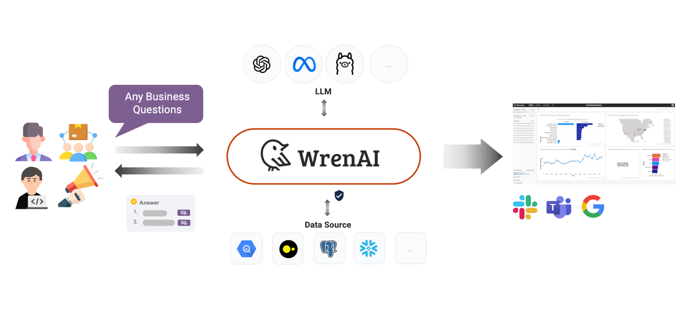

  <a href="https://getwren.ai/?utm_source=github&utm_medium=title&utm_campaign=readme">
    <picture>
      <source media="(prefers-color-scheme: light)" srcset="./misc/wrenai_logo.png">
      
    </picture>
    <h1 align="center">Wren AI - Open-Source GenBI Agent</h1>
  </a>

  
  
  
  
  
  

  

> Wren AI is your GenBI Agent, that you can query any database with natural language → get accurate SQL(Text-to-SQL), charts(Text-to-Charts) & AI-generated insights in seconds. ⚡️

  

## 😍 Demos

https://github.com/user-attachments/assets/f9c1cb34-5a95-4580-8890-ec9644da4160

[Watch GenBI Demo](https://github.com/user-attachments/assets/90ad1d35-bb1e-490b-9676-b29863ff090b)

## 🤖 Features

|                    | What you get | Why it matters |
|--------------------|--------------|----------------|
| **Talk to Your Data** | Ask in any language → precise SQL & answers | Slash the SQL learning curve |
| **GenBI Insights** | AI-written summaries, charts & reports | Decision-ready context in one click |
| **Semantic Layer** | MDL models encode schema, metrics, joins | Keeps LLM outputs accurate & governed |
| **Embed via API**  | Generate queries & charts inside your apps ([API Docs](https://wrenai.readme.io/reference/cloud-getting-started)) | Build custom agents, SaaS features, chatbots ([Streamlit Live Demo](https://huggingface.co/spaces/getWrenAI/wrenai-cloud-api-demo)) |

🤩 [Learn more about GenBI](https://getwren.ai/genbi?utm_source=github&utm_medium=content&utm_campaign=readme)

## 🚀 Getting Started

Using Wren AI is super simple, you can set it up within 3 minutes, and start to interact with your data!

- Visit our [Install in your local environment](http://docs.getwren.ai/oss/installation?utm_source=github&utm_medium=content&utm_campaign=readme).
- Visit the [Usage Guides](https://docs.getwren.ai/oss/guide/connect/overview?utm_source=github&utm_medium=content&utm_campaign=readme) to learn more about how to use Wren AI.
- Or just start with [Wren AI Cloud](https://getwren.ai/?utm_source=github&utm_medium=content&utm_campaign=readme) our Managed Cloud Service. ([OSS vs. Commercial Plans](https://docs.getwren.ai/oss/overview/cloud_vs_self_host)).

## 🏗️ Architecture

  

👉 [Learn more about our Design](https://getwren.ai/post/how-we-design-our-semantic-engine-for-llms-the-backbone-of-the-semantic-layer-for-llm-architecture?utm_source=github&utm_medium=content&utm_campaign=readme)

## 🔌 Data Sources

If your data source is not listed here, vote for it in our [GitHub discussion thread](https://github.com/Canner/WrenAI/discussions/327). It will be a valuable input for us to decide on the next supported data sources.
- Athena (Trino)
- Redshift
- BigQuery
- DuckDB
- PostgreSQL
- MySQL
- Microsoft SQL Server
- ClickHouse
- Oracle
- Trino
- Snowflake

## 🤖 LLM Models

Wren AI supports integration with various Large Language Models (LLMs), including but not limited to:
- OpenAI Models
- Azure OpenAI Models
- DeepSeek Models
- Google AI Studio – Gemini Models
- Vertex AI Models (Gemini + Anthropic)
- Bedrock Models
- Anthropic API Models
- Groq Models
- Ollama Models
- Databricks Models

Check [configuration examples here](https://github.com/Canner/WrenAI/tree/main/wren-ai-service/docs/config_examples)!

> [!CAUTION]
> The performance of Wren AI depends significantly on the capabilities of the LLM you choose. We strongly recommend using the most powerful model available for optimal results. Using less capable models may lead to reduced performance, slower response times, or inaccurate outputs.

## 📚 Documentation

Visit [Wren AI documentation](https://docs.getwren.ai/oss/overview/introduction?utm_source=github&utm_medium=content&utm_campaign=readme) to view the full documentation.

## 📪 Keep Posted?

[Subscribe our blog](https://www.getwren.ai/blog/?utm_source=github&utm_medium=content&utm_campaign=readme) and [Follow our LinkedIn](https://www.linkedin.com/company/wrenai)

## 🛠️ Contribution

1.	Star ⭐ the repo to show support (it really helps).
2.	Open an issue for bugs, ideas, or discussions.
3.	Read [Contribution Guidelines](https://github.com/Canner/WrenAI/blob/main/CONTRIBUTING.md) for setup & PR guidelines.

## ⭐️ Community

- Join 1.3k+ developers in our [Discord](https://discord.gg/5DvshJqG8Z) for real-time help and roadmap previews.
- If there are any issues, please visit [GitHub Issues](https://github.com/Canner/WrenAI/issues).
- Explore our [public roadmap](https://wrenai.notion.site/) to stay updated on upcoming features and improvements!

Please note that our [Code of Conduct](./CODE_OF_CONDUCT.md) applies to all Wren AI community channels. Users are **highly encouraged** to read and adhere to them to avoid repercussions.

## 🎉 Our Contributors

  <a href="#top">⬆️ Back to Top</a>

