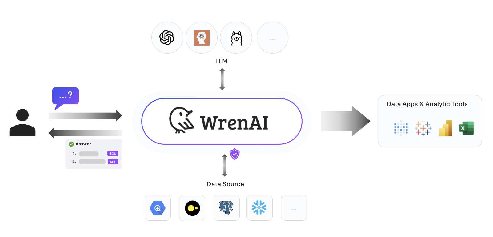

  <a href="https://getwren.ai/?utm_source=github&utm_medium=title&utm_campaign=readme">
    <picture>
      <source media="(prefers-color-scheme: light)" srcset="./misc/wrenai_logo.png">
      
    </picture>
    <h1 align="center">Wren AI</h1>
  </a>

  
  
  
  
  

## Wren AI @ Hacktoberfest 2024 - Oct 1 till Oct 31

[Hacktoberfest 2024](https://hacktoberfest.com/) is here, and we're inviting developers of all levels to join our open-source community. Together, we'll build Wren AI as a friendly community for all. 

👉 Learn how to [win a Wren AI Exclusive Swag Pack & Holopin from DigitalOcean Rewards](https://getwren.ai/wren-ai-hacktoberfest-2024)!

---

> Wren AI is a **SQL AI Agent** for data teams to get results and insights faster by asking business questions without writing SQL.

## 🕶 Try it yourself!

https://github.com/user-attachments/assets/737bbf1f-f9f0-483b-afb3-2c622c9b91ba

👉 [Try with your data!](https://getwren.ai/?utm_source=github&utm_medium=content&utm_campaign=readme)

## 🎯 Our Vision & Mission

Wren AI’s mission is to democratize data by bringing AI agents with SQL ability to any data source.

🤩 [About our Vision](https://www.getwren.ai/post/the-new-wave-of-composable-data-systems-and-the-interface-to-llm-agents)

🙌 [About our Mission](https://www.getwren.ai/post/4-key-technical-challenges-using-rag-with-llms-to-query-database-text-to-sql-and-how-to-solve-it)

## 🤖 SQL AI Agent on your data

### 1. Indexing With Semantics

> Wren AI has implemented a [semantic engine architecture](https://www.getwren.ai/post/how-we-design-our-semantic-engine-for-llms-the-backbone-of-the-semantic-layer-for-llm-architecture) to provide the LLM context of your business; you can easily establish a logical presentation layer on your data schema that helps LLM learn more about your business context.

### 2. Generate SQL Queries With Context

> With Wren AI, you can process metadata, schema, terminology, data relationships, and the logic behind calculations and aggregations with [“Modeling Definition Language”](https://docs.getwren.ai/oss/engine/concept/what_is_mdl), reducing duplicate coding and simplifying data joins.

### 3. Get Insights Without Writing Code

> When starting a new conversation in Wren AI, your question is used to find the most relevant tables. From these, LLM generates three relevant questions for the user to choose from. You can also ask follow-up questions to get deeper insights.

### 4. Self-Learning Feedback Loop (Coming Soon)

  > The AI self-learning feedback loop refines SQL augmentation and generation by collecting data from various sources. These include user query history, revision intentions, feedback, schema patterns, semantic enhancements, and query frequency.

## 🤔 Why Wren AI?

We focus on providing an open, secure, and reliable SQL AI Agent for everyone.

### 1. Turnkey Solution

> Wren AI makes it easy to onboard your data. Discover and analyze your data with our user interface. Effortlessly generate results without needing to code.

### 2. Secure By Design

> Your database content will never be transmitted to the LLM. Only metadata, like schemas, documentation, and queries, will be used in semantic search.

### 3. Open-Source

> Deploy Wren AI anywhere you like on your own data, LLM APIs, and environment, it's free.

## 🤖 Wren AI Agentic Architecture

Wren AI consists of three core services:

- ***[Wren UI](https://github.com/Canner/WrenAI/tree/main/wren-ui):*** An intuitive user interface for asking questions, defining data relationships, and integrating data sources.

- ***[Wren AI Service](https://github.com/Canner/WrenAI/tree/main/wren-ai-service):*** Processes queries using a vector database for context retrieval, guiding LLMs to produce precise SQL outputs.

- ***[Wren Engine](https://github.com/Canner/wren-engine):*** Serves as the semantic engine, mapping business terms to data sources, defining relationships, and incorporating predefined calculations and aggregations.

## ❤️ Knowledge Sharing From Wren AI

Want to get our latest sharing? [Follow our blog!](https://www.getwren.ai/blog)

## 🚀 Getting Started

Using Wren AI is super simple, you can set it up within 3 minutes, and start to interact with your data!

- Visit our [Installation Guide of Wren AI](http://docs.getwren.ai/oss/installation).
- Visit the [Usage Guides](https://docs.getwren.ai/oss/guide/connect/overview) to learn more about how to use Wren AI.

## 📚 Documentation

Visit [Wren AI documentation](https://docs.getwren.ai/oss/overview/introduction) to view the full documentation.

## 🛠️ Contribution

Want to contribute to Wren AI? Check out our [Contribution Guidelines](https://github.com/Canner/WrenAI/blob/main/CONTRIBUTING.md).

## ⭐️ Community

- Welcome to our [Discord server](https://discord.gg/5DvshJqG8Z) to give us feedback!
- If there are any issues, please visit [GitHub Issues](https://github.com/Canner/WrenAI/issues).

Please note that our [Code of Conduct](./CODE_OF_CONDUCT.md) applies to all Wren AI community channels. Users are **highly encouraged** to read and adhere to them to avoid repercussions.

## 🎉 Our Contributors
<!-- Do not manually edit this section! It should get updated using the Github action -->
<!-- readme: contributors -start -->
<table>
	<tbody>
		<tr>
            <td align="center">
                <a href="https://github.com/cyyeh">
                    
                     
                    <b>cyyeh</b>
                </a>
            </td>
            <td align="center">
                <a href="https://github.com/onlyjackfrost">
                    
                     
                    <b>onlyjackfrost</b>
                </a>
            </td>
            <td align="center">
                <a href="https://github.com/wwwy3y3">
                    
                     
                    <b>wwwy3y3</b>
                </a>
            </td>
            <td align="center">
                <a href="https://github.com/andreashimin">
                    
                     
                    <b>andreashimin</b>
                </a>
            </td>
            <td align="center">
                <a href="https://github.com/paopa">
                    
                     
                    <b>paopa</b>
                </a>
            </td>
            <td align="center">
                <a href="https://github.com/chilijung">
                    
                     
                    <b>chilijung</b>
                </a>
            </td>
		</tr>
		<tr>
            <td align="center">
                <a href="https://github.com/fredalai">
                    
                     
                    <b>fredalai</b>
                </a>
            </td>
            <td align="center">
                <a href="https://github.com/imAsterSun">
                    
                     
                    <b>imAsterSun</b>
                </a>
            </td>
            <td align="center">
                <a href="https://github.com/Ayushjhawar8">
                    
                     
                    <b>Ayush Jhawar</b>
                </a>
            </td>
            <td align="center">
                <a href="https://github.com/qdrddr">
                    
                     
                    <b>qdrddr</b>
                </a>
            </td>
            <td align="center">
                <a href="https://github.com/kushal34712">
                    
                     
                    <b>kushal34712</b>
                </a>
            </td>
            <td align="center">
                <a href="https://github.com/goldmedal">
                    
                     
                    <b>goldmedal</b>
                </a>
            </td>
		</tr>
		<tr>
            <td align="center">
                <a href="https://github.com/eltociear">
                    
                     
                    <b>eltociear</b>
                </a>
            </td>
            <td align="center">
                <a href="https://github.com/himanshu634">
                    
                     
                    <b>himanshu634</b>
                </a>
            </td>
            <td align="center">
                <a href="https://github.com/AryanK1511">
                    
                     
                    <b>AryanK1511</b>
                </a>
            </td>
            <td align="center">
                <a href="https://github.com/kpman">
                    
                     
                    <b>kpman</b>
                </a>
            </td>
            <td align="center">
                <a href="https://github.com/grieve54706">
                    
                     
                    <b>grieve54706</b>
                </a>
            </td>
            <td align="center">
                <a href="https://github.com/RoacherM">
                    
                     
                    <b>RoacherM</b>
                </a>
            </td>
		</tr>
		<tr>
            <td align="center">
                <a href="https://github.com/Innovatorcloudy">
                    
                     
                    <b>Innovatorcloudy</b>
                </a>
            </td>
            <td align="center">
                <a href="https://github.com/NishantRana07">
                    
                     
                    <b>Nishant Rana</b>
                </a>
            </td>
            <td align="center">
                <a href="https://github.com/sahil9001">
                    
                     
                    <b>sahil9001</b>
                </a>
            </td>
            <td align="center">
                <a href="https://github.com/yb-sid">
                    
                     
                    <b>yb-sid</b>
                </a>
            </td>
            <td align="center">
                <a href="https://github.com/Prototype4988">
                    
                     
                    <b>Prototype4988</b>
                </a>
            </td>
            <td align="center">
                <a href="https://github.com/iamawanishmaurya">
                    
                     
                    <b>iamawanishmaurya</b>
                </a>
            </td>
		</tr>
	<tbody>
</table>
<!-- readme: contributors -end -->
