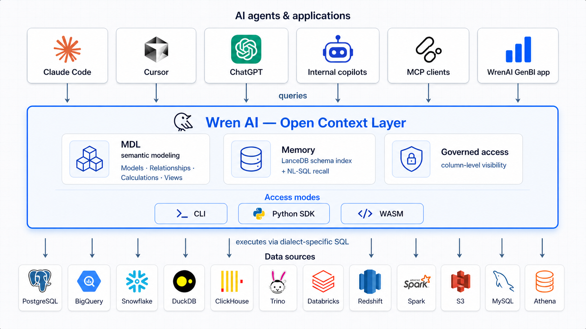

<div align="center" id="top">

<a href="https://getwren.ai">
  <picture>
    <source media="(prefers-color-scheme: dark)" srcset="./misc/wrenai_logo_white.png">
    
  </picture>
</a>

### The open context layer for AI agents over business data.

*Your agent doesn't know what your data means. We fix that.*

[Docs](https://docs.getwren.ai) · [Discord](https://discord.gg/5DvshJqG8Z) · [Vision](https://www.getwren.ai/post/the-missing-context-layer-for-ai-agents-over-business-data) · [Blog](https://www.getwren.ai/blog)

[](LICENSE)
[](https://pypi.org/project/wren-engine/)
[](https://github.com/Canner/WrenAI/releases)
[](https://discord.gg/5DvshJqG8Z)
[](https://github.com/Canner/WrenAI/commits/main)
[](https://x.com/getwrenai)
[](https://cannerdata.com)


<a href="https://trendshift.io/repositories/9263" target="_blank"></a>

</div>

> 📣 **2026-05-07** — Wren Engine has merged into this repo under [`core/`](./core). The previous `Canner/wren-engine` repo is archived. The previous WrenAI GenBI app is preserved on the [`legacy/v1`](https://github.com/Canner/WrenAI/tree/legacy/v1) branch (tag `v1-final`). [Read the announcement →](https://github.com/Canner/WrenAI/discussions/2205)

<!--
  📺 HERO DEMO (place here)
  ─────────────────────────
  Suggested: a 5–10 second silent loop showing:
    1. Terminal: `wren ask "who are our top 10 customers this quarter?"`
    2. Agent fetches context (memory + MDL) — visible reasoning trace
    3. Final SQL + result table
  Format: .gif (≤2 MB) or .mp4 (autoplay-muted).
  Save under  /assets/wrenai-demo.gif  and use the line below:

  
-->

---

## What WrenAI is

WrenAI is the **open context layer** that gives your agents what schemas don't: business semantics, examples, memory, governance, and — soon — the unstructured corporate knowledge that lives in your docs, wikis, and chat threads. Built for the agent frameworks you already use. 



## Why agent builders pick WrenAI

- **Open by default** — Apache-2.0 core, SDK, and skills.
- **Built for AI agents** — Skills, agentic architecutre, context retrieval are first-class. Ships as SDKs for the agent frameworks engineers already use.
- **Correctness as primitives** — rich schema retrieval, dry-plan validation, structured errors with hints, value profiling, eval runner. The agent orchestrates; the trace lives in the agent's reasoning.
- **Reviewable, reproducible context** — every definition, example, and mapping is versionable and evidence-linked. Git-friendly. Not chat history.
- **Sits on top of your existing stack** — warehouse, transformation pipelines, your existing semantic layer. Not another tool to maintain.

## The problem

If you're building AI agents, embedded analytics, or natural-language data products on top of your enterprise databases, you've hit the same wall: there's no shared governed layer between your data and your consumers. Your agents query Postgres, MySQL, SQL Server, Oracle, Snowflake, BigQuery, or Databricks through raw SQL or MCP — and they hallucinate joins, guess at table semantics, and invent metric definitions every time. Your analysts and your apps each reinvent the same logic in their own dialect. Your local LLMs and cloud LLMs need the same governed context to produce trustworthy answers, but nothing today provides it. The result is a multiplication problem: N agents × M databases × K models = N×M×K brittle integrations, none of which agree. The missing piece is a context layer purpose-built for the agent era — open, MCP-native, and interoperable across every database and every model.


## Quickstart

WrenAI is **agent-driven by design**: you install the skill bundle once, then let your AI coding agent (Claude Code, Openclaw, Hermes, Codex, etc.) drive the rest — Python deps, DB connection, project scaffold, and first query.

### 1. Install the skill bundle

Skills are workflow guides that teach AI coding agents (Claude Code, Openclaw, Hermes, Codex, etc.) how to drive the Wren CLI for you.

```bash
npx skills add Canner/WrenAI --skill '*'
```

Have multiple AI coding agents installed and want the skills available in all of them? Pass `--agent '*'`:

```bash
npx skills add Canner/WrenAI --skill '*' --agent '*'
```

Or via the install script:

```bash
curl -fsSL https://raw.githubusercontent.com/Canner/WrenAI/main/skills/install.sh | bash
```

See the [Skills reference](https://docs.getwren.ai/oss/reference/skills) for the full list of skills installed and what each one does.

### 2. Ask your agent to set things up

Open your agent in a project directory and ask:

Use the `/wren-onboarding` skill to install and set up Wren AI.

The agent will check your environment, install `wren-engine`, create a connection profile, scaffold the project, and run a first query — all in one flow.

### 3. (Optional) Enrich the project

Once onboarding finishes, give your project the business context schemas can't carry:

Use the `/wren-enrich-context` skill in grill mode.

Two modes: **grill** (one question at a time, you in the loop) or **auto-pilot** (agent reads `<project>/raw/` and proposes). Both modes write to MDL, instructions, queries, and memory — all reviewable, all Git-friendly.

### 4. Ask questions

```bash
# Ask any question
"who are our top 10 customers by sales this quarter?"
```

Or just ask your agent in natural language — it uses the context layer to resolve schema, recall similar past queries, and write governed SQL.

**Want to try it without your own database?** Ask your agent to run `/wren-onboarding` with the bundled `jaffle_shop` sample dataset — same flow, but you'll be querying a real warehouse end-to-end in a couple of minutes.

## Two beats: scaffold fast, enrich deep

```bash
/wren-onboarding         # Scaffold a Wren project from your DB (agent-driven)
/wren-enrich-context     # One skill, two modes: (Under development)
                         #   grill      — one question at a time, you in the loop
                         #   auto-pilot — agent reads <project>/raw/ and proposes
wren ask "..."           # Query through the context layer
```

Fast at first. Deep when you need it. Always reviewable and Git-friendly.

<!--
  📷 OPTIONAL: 2-up screenshot showing grill mode (left) vs auto-pilot mode (right).
  Save under  /assets/two-beats.png
-->

## What works today

- **Modeling Definition Language (MDL)** — models, columns, relationships, views, cubes, metrics, row-level / column-level access control (RLAC / CLAC)
- **Engine** — Apache DataFusion based, 22+ data sources
- **Memory & examples** — LanceDB-backed, hybrid retrieval, versionable
- **Agent SDK** — `wren-langchain` (LangChain / LangGraph), `wren-pydantic`; reference Python integration for other stacks
- **Governed execution primitives** — functions, dry-plan, row limits, access control

## What's next

- **Context enrichment skill** — `/wren-enrich-context` (grill + auto-pilot modes) hardened across MDL, instructions, queries, and memory
- **End-to-end correctness primitives** — value profiling, rich retrieval, structured errors, golden eval runner
- **Agent-native distribution** — first-class SDKs across major agent frameworks; see [GitHub Discussions](https://github.com/Canner/WrenAI/discussions) for what's prioritized next
- **Full governed execution** — audit logs, rate limits, approval workflow, data-flow inspector

<!-- TODO: vision_paper_en.md is currently at .tmp/roadmap-discuss/vision_paper_en.md — move to a published path (e.g. docs/vision-paper.md or repo root) and update this link before publishing. -->
Full roadmap and design notes: see the [vision paper](./vision_paper_en.md).

## Documentation

- [Quickstart](https://docs.getwren.ai/oss/get_started/quickstart) — from skill install to first answer
- [Concepts](https://docs.getwren.ai/oss/concepts/what_is_context) — what context is, what MDL is, how memory works
- [Connect a database](https://docs.getwren.ai/oss/guides/connect/overview) — Postgres, BigQuery, Snowflake, DuckDB, and more
- [Agent SDKs](https://docs.getwren.ai/oss/sdk/overview) — what's shipping today, what's next

## Community

- 💬 [Discord](https://discord.gg/5DvshJqG8Z) — chat with the team and other builders
- 🐙 [GitHub Discussions](https://github.com/Canner/WrenAI/discussions) — design conversations, RFCs, longer threads
- 🐦 [Twitter / X](https://x.com/getwrenai) — release notes and short updates
- 🗞 [Blog](https://www.getwren.ai/blog) — vision, post-mortems, deep dives

## Contributing

We build in the open. Issues, PRs, connector contributions, SDK integrations, docs fixes — all welcome.

- [Contributor guide](./CONTRIBUTING.md)
- [Connector ecosystem program](./docs/contributing-a-connector.md) — three-tier ownership: official, community-blessed, community-owned
- [Architecture map](./docs/architecture.md) — find the right place to land your change
- Looking for somewhere to start? Try the [`good first issue`](https://github.com/Canner/WrenAI/labels/good%20first%20issue) label.

<details>
<summary><strong>Project structure</strong> — click to expand</summary>

```
core/
  wren-core/         Rust semantic engine (Apache DataFusion)
  wren-core-base/    Shared manifest types + MDL builder
  wren-core-py/      Python bindings (PyPI: wren-core)
  wren-core-wasm/    WebAssembly build (npm: wren-core-wasm)
  wren/              Python SDK and CLI (PyPI: wren-engine)
  wren-mdl/          MDL JSON schema
sdk/
  wren-langchain/    Reference agent SDK integration
skills/              Agent skills for context authoring
docs/                Module documentation
examples/            Example projects
```

</details>

## Contributors

<a href="https://github.com/Canner/WrenAI/graphs/contributors">
  
</a>

## License

Apache 2.0. See [LICENSE](./LICENSE).

---

<div align="center">

*Come build the context layer with us.*

**If WrenAI helps you, drop a ⭐ — it genuinely helps us grow!**

<p><a href="#top">⬆️ Back to top</a></p>

</div>
