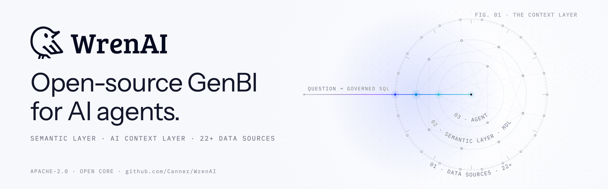

<div align="center" id="top">
<a href="https://getwren.ai">
  <picture>
    <source media="(prefers-color-scheme: dark)" srcset="./misc/wren-ai-banner-dark.png">
    
  </picture>
</a>

### Open-source GenBI for AI agents

**Your agents generate governed SQL, deploy dashboards, and keep business definitions in Git, across 22+ data sources.**

<br/>

**[Get started in 3 commands ↓](#quickstart)** &nbsp;·&nbsp; **[Read the docs →](https://docs.getwren.ai)** &nbsp;·&nbsp; **[Join Discord →](https://discord.gg/5DvshJqG8Z)**

<br/>

[](https://github.com/Canner/WrenAI/blob/main/LICENSE)
[](https://pypi.org/project/wrenai/)
[](https://github.com/Canner/WrenAI/releases)
[](https://discord.gg/5DvshJqG8Z)
[](https://x.com/getwrenai)


<a href="https://trendshift.io/repositories/9263" target="_blank"></a>

</div>

---

## What WrenAI is

WrenAI is the open-source **generative BI (GenBI) engine**. It gives the AI agents you already use (Claude Code, Cursor, MCP clients, LangChain) a **governed semantic layer** and an **AI context layer**, so they turn business questions into correct SQL, ship the answer as a shareable dashboard, and stay inside your guardrails.

Schemas tell an agent where data lives. Wren tells it what the data *means*: approved metric definitions, enums, units, joins, worked examples, and the tribal knowledge buried in docs and chat threads. All of it lives as reviewable YAML and Markdown in a repo you own.

<picture>
  <source media="(prefers-color-scheme: dark)" srcset="./misc/wren-ai-architecture-dark.png">
  
</picture>

## Quickstart

Three commands, then your agent does the rest. Works with Claude Code, Cursor, Cline, Codex, and [50+ other agents](https://docs.getwren.ai/oss/get_started/quickstart).

**1. Install the CLI**

```bash
pip install wrenai
```

Add connector extras as you need them, for example `pip install "wrenai[postgres,memory]"`.

**2. Teach your agent about Wren**

```bash
npx skills add Canner/WrenAI
```

This installs a ~50-line discovery stub. Your agent fetches full workflow guides from the CLI on demand, so instructions always match the installed version.

**3. Open your agent in a project folder and ask**

> "Use Wren to set up my Postgres database."

The agent checks your environment, creates a connection profile, scaffolds the project, and runs a first query.

**No database handy?** Say "Use Wren with the bundled `jaffle_shop` sample" and run the same flow against a real sample warehouse.

<details>
<summary>Slow <code>pip install</code> from mainland China?</summary>

```bash
pip install wrenai -i https://pypi.tuna.tsinghua.edu.cn/simple
```

If HuggingFace model downloads time out, run `export HF_ENDPOINT=https://hf-mirror.com` before using the CLI.

</details>

### Then keep going

Once you're connected, these three prompts cover the whole GenBI loop:

| Beat | Ask your agent | What happens |
|---|---|---|
| **Know** | "Enrich my Wren project with the business context in `raw/`." | Runs `wren skills get enrich-context`. Writes definitions, examples, and memory as reviewable files. |
| **Generate** | "Who are our top 10 customers by sales this quarter?" | Recalls MDL context and past queries, writes governed SQL, executes via `wren query`. |
| **Deploy** | "Turn that into a dashboard I can filter and share, deployed to Vercel." | Runs `wren skills get genbi`. Builds a browser-side app and returns a live URL on your Vercel or Cloudflare Pages account. |

<div align="center">

**[Follow the full quickstart →](https://docs.getwren.ai/oss/get_started/quickstart)** &nbsp;·&nbsp; [Build & deploy a GenBI app →](https://docs.getwren.ai/oss/guides/genbi)

</div>

## Why agent builders pick WrenAI

- **Answers *and* dashboards, not just SQL.** Generate a governed answer, deploy it as a dashboard, share the URL. One agent-driven loop, end to end.
- **Correct instead of confidently wrong.** Schema-aware retrieval, MDL planning, dry-plan validation, row limits, value profiling, and structured errors with hints keep agent SQL inside guardrails.
- **Business meaning lives in Git.** Metric definitions, enums, approved joins, and proven examples are versioned files. Review them in a pull request. Diff them. Take them with you.
- **Works through the agents you already run.** Claude Code, Cursor, Cline, Codex, MCP clients, LangChain. Wren is a layer, not another chat UI to adopt.
- **Sits on your existing stack.** Warehouse, transformation pipelines, existing semantic models. 22+ sources on one Apache DataFusion engine.
- **Open by default.** Core engine, SDK, and skills under Apache-2.0. It runs without us.

### How Wren compares

|  | A raw LLM agent | A traditional BI tool | A bare semantic layer | **WrenAI** |
|---|:---:|:---:|:---:|:---:|
| Writes SQL for you | ✅ (often wrong) | ❌ | ❌ | ✅ governed |
| Knows your business definitions | ❌ | partial, in-tool | ✅ (schema only) | ✅ + non-schema knowledge |
| Generates & deploys dashboards | ❌ | ✅ (manual, in-tool) | ❌ | ✅ agent-driven |
| Works through *your* agents (Claude Code, Cursor, MCP…) | ✅ | ❌ | ❌ | ✅ |
| Open, reviewable, Git-friendly context | ❌ | ❌ | partial | ✅ |
| Governed execution across 22+ sources | ❌ | per-connector | ✅ (definitions only) | ✅ |

### Wren is for you if…

- You want **AI agents to produce trustworthy BI**, answers *and* dashboards, not just plausible SQL.
- Your business logic (definitions, enums, units, approved joins) lives **outside the database** and your agents keep getting it wrong.
- You want a context layer that is **open, reviewable, and version-controlled**, usable by every agent and every person, not gated behind one vendor's UI.

**Skip Wren if** you only need a one-off chart from a single CSV, or you're happy letting an agent guess at SQL with no governance.

## Take it to your team with `git push`

Everything Wren writes on your laptop is plain YAML and Markdown in a repo you own. **Git Sync** turns that same repo into a governed, team-wide GenBI deployment in Wren Cloud or a self-hosted installation, including air-gapped. Nothing to export, nothing to re-model.

- **No new CLI to learn.** Bind a directory once with `wren cloud create` or `wren cloud link`. After that, `git push` and `git pull` are the entire interface.
- **Metrics reviewed like code.** A change to `net_revenue` shows up as a readable diff in a pull request on GitHub, GitLab, Bitbucket, or your own remote. Run CI on it. Promote staging to production like application code.
- **You keep the repo, always.** Clone it, back it up, feed it to another tool, or leave with it, any time.
- **No reusable credential on disk.** Every push authenticates with a fresh token that expires in 600 seconds. The durable key stays in `~/.wren/cloud.yml` (mode `0600`) and is never handed to git.

```bash
$ git push
To cloud.getwren.ai/acme/wren-analytics.git
   9f2c1a4..b71e0d3  main -> main
✔ deploy queued · model queryable in Wren Cloud
```

<div align="center">

**[See how Git Sync works →](https://www.getwren.ai/git-sync)** &nbsp;·&nbsp; [CLI reference: `wren cloud`](./docs/core/reference/cli.md#wren-cloud--connect-a-project-to-wren-cloud)

</div>

### Open core: what's OSS, what's commercial

The engine in this repo (MDL semantic layer, governed text-to-SQL, MCP server, CLI, 22+ connectors) is Apache-2.0, free forever, and self-hostable. The following are commercial, delivered as **Wren AI Cloud** or self-hosted **Enterprise Plus**:

- **Row- and column-level security** and access control with users and groups
- **GenBI UI, dashboards, embedded and APIs**
- **Scenario AI harnesses**: GenBI Apps, Agentic Mode, AI-assisted context preparation
- **Advanced security and audit, support and SLAs**, plus cloud, VPC, and air-gapped deployment

Same engine underneath. Your MDL stays in your Git either way. **[Read the published boundary →](https://www.getwren.ai/en/open-core)**

## Under the hood

### Semantic layer (MDL)

Wren **is** a governed semantic layer, expressed in the **Modeling Definition Language (MDL)**: a Git-friendly definition of what your data *means*, not just where it lives. Every answer and dashboard is planned against it.

- **Models, columns, relationships, views**: the shape of your data, decoupled from any one warehouse.
- **Cubes and metrics**: approved, reusable definitions so "revenue" means the same thing everywhere.
- **Context beyond the schema**: enums, units, approved joins, and definitions in `instructions.md` and `queries.yml`.

### What's included

- **Engine**: Apache DataFusion based. BigQuery, Snowflake, PostgreSQL, ClickHouse, Amazon Redshift, Databricks, DuckDB, and more. [Connect a database →](https://docs.getwren.ai/oss/guides/connect)
- **GenBI dashboards**: agent-built, browser-side apps powered by [`wren-core-wasm`](https://docs.getwren.ai/oss/sdk/wasm), deployable to Vercel or Cloudflare Pages
- **Knowledge and memory**: version-controlled `instructions.md` and `queries.yml`, plus a local LanceDB memory index with hybrid retrieval
- **Agent SDKs**: `wren-langchain` (LangChain / LangGraph), `wren-pydantic`, and a reference Python integration for other stacks. [SDK overview →](https://docs.getwren.ai/oss/sdk/overview)
- **Governed execution primitives**: functions, dry-plan validation, row limits, structured errors

### Day-to-day commands

```bash
wren skills get onboarding         # workflow guide: set up project + first query
wren skills get enrich-context     # workflow guide: add business context
wren skills get genbi              # workflow guide: build & deploy a dashboard

wren query --sql '...'             # query through the MDL semantic layer
wren ask "<question>" --guided     # wrap a question for a weaker agent
wren ask "<question>" --direct     # wrap a question for a stronger agent
```

Full reference: [CLI](./docs/core/reference/cli.md) · [MDL](./docs/core/reference/mdl.md) · [Architecture](./docs/core/reference/architecture.md)

### What's next

- **End-to-end correctness primitives**: value profiling, rich retrieval, structured errors, golden eval runner
- **Agent-native distribution**: first-class SDKs across major agent frameworks

Vote on what ships next in [GitHub Discussions →](https://github.com/Canner/WrenAI/discussions)

## FAQ

<details>
<summary><b>What is generative BI (GenBI)?</b></summary>

Business intelligence produced by AI agents. Instead of a person building charts by hand, an agent generates governed SQL, deploys a dashboard, and shares it, grounded in an AI context layer so the output is trustworthy rather than merely plausible. Wren AI is the open-source GenBI engine.

</details>

<details>
<summary><b>Does Wren AI do text-to-SQL?</b></summary>

Yes, and governed: questions become SQL planned against your semantic layer (MDL) and dry-plan validated before execution. Wren then goes further, deploying dashboards and managing the context that keeps answers correct.

</details>

<details>
<summary><b>Is Wren AI a semantic layer?</b></summary>

Yes. Wren is a governed semantic layer expressed in MDL (models, metrics, relationships), paired with an AI context layer (memory, examples, unstructured knowledge) and a governed execution engine that runs those definitions across 22+ sources.

</details>

<details>
<summary><b>What is an AI context layer?</b></summary>

The reviewable, version-controlled knowledge agents need but schemas don't provide: business semantics, approved definitions, examples, memory, and governance. Read the vision: [The missing context layer for AI agents over business data](https://www.getwren.ai/post/the-missing-context-layer-for-ai-agents-over-business-data).

</details>

<details>
<summary><b>What happened to the Docker-based Wren AI GenBI app?</b></summary>

On 2026-05-07 Wren Engine merged into this repo under [`core/`](./core), and the previous `Canner/wren-engine` repo was archived. The earlier chat-first BI product is now **Wren GenBI Classic**, preserved on the [`legacy/v1`](https://github.com/Canner/WrenAI/tree/legacy/v1) branch (tag `v1-final`) with no new features or security fixes. For a maintained, hosted version of that experience, see [Wren AI Commercial](https://getwren.ai). [Read the announcement →](https://github.com/Canner/WrenAI/discussions/2205)

</details>

## Documentation

- [Quickstart](https://docs.getwren.ai/oss/get_started/quickstart): from skill install to first answer
- [Build & deploy a GenBI app](https://docs.getwren.ai/oss/guides/genbi): generate a dashboard and ship it
- [Concepts](https://docs.getwren.ai/oss/concepts/what_is_context): what context is, what MDL is, how memory works
- [Connect a database](https://docs.getwren.ai/oss/guides/connect): Postgres, BigQuery, Snowflake, DuckDB, and more
- [Agent SDKs](https://docs.getwren.ai/oss/sdk/overview): what's shipping today, what's next
- [Git Sync](https://www.getwren.ai/git-sync): `git push` your open-source project to governed, team-wide GenBI

## Community

- 💬 [Discord](https://discord.gg/5DvshJqG8Z): get unstuck fast, chat with the team and other builders
- 🐙 [GitHub Discussions](https://github.com/Canner/WrenAI/discussions): design conversations, RFCs, roadmap votes
- 🐦 [Twitter / X](https://x.com/getwrenai): release notes and short updates
- 🗞 [Blog](https://www.getwren.ai/blog): vision, post-mortems, deep dives

## Contributing

We build in the open. Issues, PRs, connectors, SDK integrations, and docs fixes are all welcome.

- **New here?** Pick up a [`good first issue`](https://github.com/Canner/WrenAI/labels/good%20first%20issue).
- [Contributor guide](./CONTRIBUTING.md): setup, conventions, and the contribution bar
- [Architecture map](./docs/core/reference/architecture.md): find the right place to land your change

<details>
<summary><b>Project structure (click to expand)</b></summary>

```
core/
  wren-core/         Rust semantic engine (Apache DataFusion)
  wren-core-base/    Shared manifest types + MDL builder
  wren-core-py/      Python bindings (PyPI: wren-core)
  wren-core-wasm/    WebAssembly build (npm: wren-core-wasm)
  wren/              Python SDK and CLI (PyPI: wrenai)
  wren-mdl/          MDL JSON schema
sdk/
  wren-langchain/    LangChain / LangGraph integration
  wren-pydantic/     Pydantic AI integration
skills/              Agent skills for context authoring
docs/                Module documentation
examples/            Example projects
```

</details>

## Contributors

<a href="https://github.com/Canner/WrenAI/graphs/contributors">
  
</a>

## License

Apache 2.0. See [LICENSE](./LICENSE).

---

<div align="center">

**If WrenAI saved you time, [star the repo](https://github.com/Canner/WrenAI) ⭐. It's the fastest way to help more agent builders find it.**

**[Get started ↑](#quickstart)** &nbsp;·&nbsp; **[Join Discord →](https://discord.gg/5DvshJqG8Z)** &nbsp;·&nbsp; **[See Git Sync →](https://www.getwren.ai/git-sync)**

<p><a href="#top">⬆️ Back to top</a></p>

</div>
