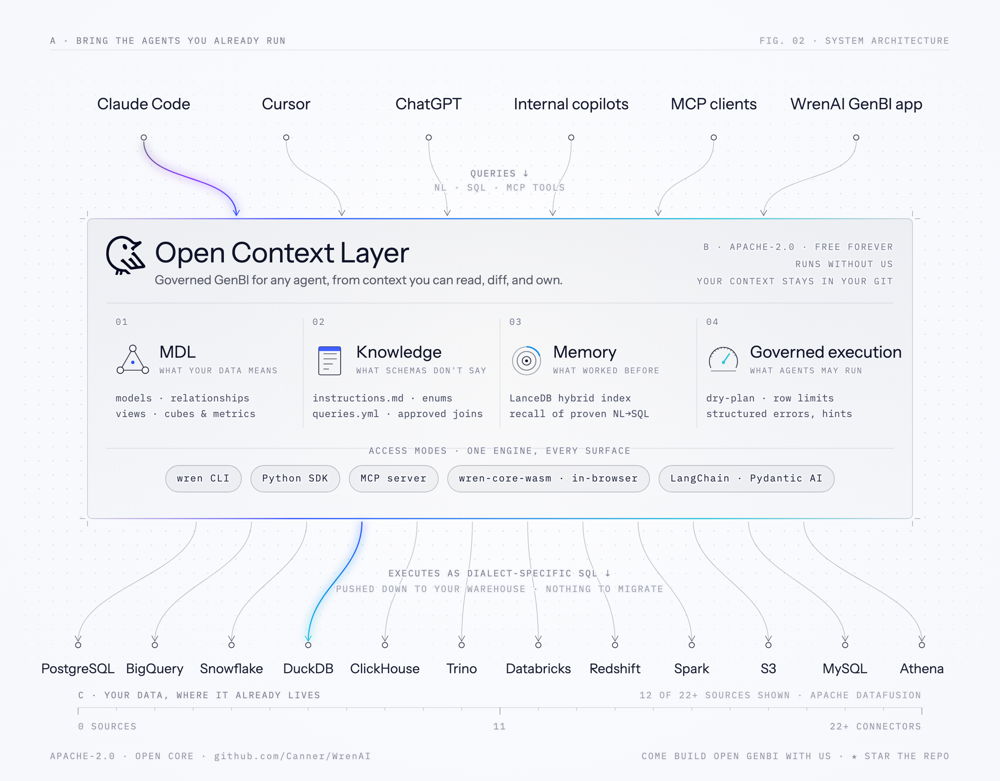

<div align="center" id="top">
<a href="https://getwren.ai">
  <picture>
    <source media="(prefers-color-scheme: dark)" srcset="./misc/wrenai_logo_white.png">
    
  </picture>
</a>


### Open-source GenBI: generative BI for AI agents.

*Your agents generate, deploy, and govern dashboards from any database, grounded in a context layer they can actually trust.*

**Wren AI is an open-source generative BI (GenBI) engine — a governed text-to-SQL and semantic-layer platform, powered by an open AI context layer, across 22+ data sources.**

[Docs](https://docs.getwren.ai) · [Discord](https://discord.gg/5DvshJqG8Z) · [Vision](https://www.getwren.ai/post/the-missing-context-layer-for-ai-agents-over-business-data) · [Blog](https://www.getwren.ai/blog)

[](https://github.com/Canner/WrenAI/blob/main/LICENSE)
[](https://pypi.org/project/wrenai/)
[](https://github.com/Canner/WrenAI/releases)
[](https://discord.gg/5DvshJqG8Z)
[](https://github.com/Canner/WrenAI/commits/main)
[](https://x.com/getwrenai)
[](https://cannerdata.com)


<a href="https://trendshift.io/repositories/9263" target="_blank"></a>

</div>

> 📣 **2026-05-07**: Wren Engine has merged into this repo under [`core/`](./core). The previous `Canner/wren-engine` repo is archived. The previous WrenAI GenBI app (the Docker-based chat-first BI product) is preserved on the [`legacy/v1`](https://github.com/Canner/WrenAI/tree/legacy/v1) branch (tag `v1-final`) and is now **Wren GenBI Classic**; see [A note on the "GenBI" name](#a-note-on-the-genbi-name) below. [Read the announcement →](https://github.com/Canner/WrenAI/discussions/2205)

---

## What WrenAI is

WrenAI is the **open-source generative BI (GenBI) engine**: it lets AI agents **generate, deploy, and govern** business intelligence, from a governed **text-to-SQL** answer to a shareable dashboard, across 22+ data sources.

What makes the output trustworthy is the layer underneath: an open **AI context layer** plus a governed **semantic layer (MDL)** that gives agents what schemas don't. That means business semantics, approved definitions, examples, memory, and governance, plus the unstructured company knowledge that lives in your docs, wikis, and chat threads. Generative BI is only as good as the context it stands on, and Wren is that context, made reviewable and reusable by every agent you already run.



## GenBI in three beats: Generate · Deploy · Know

- **Generate.** Your agent turns a business question into *governed* **text-to-SQL** and charts. Schema-aware retrieval, MDL planning, dry-plan validation, and structured errors keep it correct instead of confidently wrong.
- **Deploy.** Turn any answer into a shareable, browser-side dashboard powered by [`wren-core-wasm`](https://docs.getwren.ai/oss/sdk/wasm) and ship it to your own Vercel or Cloudflare Pages account with one command.
- **Know.** The knowledge that makes all of this correct lives in versionable, evidence-linked files: semantic models (MDL), company definitions (`instructions.md`), and a memory of what worked. Reviewable. Git-friendly. Never locked inside someone else's UI.

## Why agent builders pick WrenAI

- **Generative BI, end to end.** Wren does **governed text-to-SQL** — and goes beyond it: generate the answer, deploy the dashboard, share the URL, all driven by the agents you already use.
- **Knowledge management built in.** Business meaning, approved definitions, and proven examples are captured as a reviewable, version-controlled **semantic layer (MDL)**, not buried in prompts.
- **Open by default.** Open-sourced core, SDK, and skills under the Apache-2.0 license.
- **Correctness as primitives.** Rich schema retrieval, dry-plan validation, structured errors with hints, value profiling, eval runner. The agent orchestrates; the trace lives in its reasoning.
- **Governed execution, reviewable context.** Dry-plan validation, row limits, and structured errors keep agent-generated SQL inside guardrails, and every definition and example lives in Git — reviewable, versioned, diff-able. (Row/column-level security and access control are Cloud / self-hosted — see [Open core: OSS vs. Cloud / self-hosted](#open-core-oss-vs-cloud--self-hosted).)
- **Sits on top of your existing stack.** Warehouse, transformation pipelines, your existing semantic layer. Not another tool to maintain.

## How Wren compares

|  | A raw LLM agent | A traditional BI tool | A bare semantic layer | **WrenAI** |
|---|:---:|:---:|:---:|:---:|
| Writes SQL for you | ✅ (often wrong) | ❌ | ❌ | ✅ governed |
| Knows your business definitions | ❌ | partial, in-tool | ✅ (schema only) | ✅ + non-schema knowledge |
| Generates & deploys dashboards | ❌ | ✅ (manual, in-tool) | ❌ | ✅ agent-driven |
| Works through *your* agents (Claude Code, Cursor, MCP…) | ✅ | ❌ | ❌ | ✅ |
| Open, reviewable, Git-friendly context | ❌ | ❌ | partial | ✅ |
| Governed execution across 22+ sources | ❌ | per-connector | ✅ (definitions only) | ✅ |

## Wren is for you if…

- You want **AI agents to produce trustworthy BI**, answers *and* dashboards, not just plausible SQL.
- Your business logic (definitions, enums, units, approved joins) lives **outside the database** and your agents keep getting it wrong.
- You want an **AI context layer** and **semantic layer** that are **open, reviewable, and version-controlled**, usable by every agent and person, not gated behind one vendor's UI.

**Skip Wren if** you only need a one-off chart from a single CSV, or you're happy letting an agent guess at SQL with no governance.

## Quickstart

WrenAI is **agent-driven by design**: install the CLI, install a one-file
discovery stub for your AI client, then let your AI agent drive the rest.
Workflow guides live inside the CLI itself and are served on demand, so
content always matches the installed version.

### 1. Install the CLI

```bash
pip install wrenai                      # core (DuckDB included)
pip install "wrenai[postgres,memory]"   # add per-datasource and memory extras as needed
```

> **Tip for users in mainland China:** If `pip install` is slow or fails, use the Tsinghua mirror:
> ```bash
> pip install wrenai -i https://pypi.tuna.tsinghua.edu.cn/simple
> ```
> If HuggingFace model downloads time out, add `export HF_ENDPOINT=https://hf-mirror.com` before running the CLI.

### 2. Install the discovery stub for your AI client

```bash
npx skills add Canner/WrenAI            # auto-detects Claude Code, Cursor, Cline, Codex, …
```

The stub is ~50 lines. It teaches your agent to fetch workflow guides via
`wren skills get <name>` and shaped prompts via
`wren ask "<question>" --guided|--direct`, and everything else lives in the CLI.

### 3. Ask your agent to set things up

Open your agent in a project directory and say something like:

> "Use Wren to set up my Postgres database."

The agent runs `wren skills get onboarding`, follows the guide step-by-step,
checks your environment, creates a connection profile, scaffolds the project,
and runs a first query.

### 4. (Optional) Enrich the project: the *Know* beat

Once onboarding finishes, ask:

> "Enrich my Wren project with the business context in `raw/`."

The agent runs `wren skills get enrich-context` and follows the guide in
**grill** mode (one question at a time) or **auto-pilot** mode (agent reads
`<project>/raw/` and proposes). Both modes write to MDL, instructions,
queries, and memory, all reviewable, all Git-friendly.

### 5. Ask questions: the *Generate* beat

> "Who are our top 10 customers by sales this quarter?"

Your agent fetches MDL context, recalls similar past queries, writes
governed SQL, and executes via `wren query`.

### 6. Build & deploy a dashboard: the *Deploy* beat

> "Turn that into an interactive dashboard I can filter and share, and deploy it to Vercel."

The agent runs `wren skills get genbi`, builds a browser-side GenBI app from
your project's context, previews it locally, and ships it to your own Vercel
or Cloudflare Pages account, returning a live, shareable URL. See the
[Build & deploy a GenBI app guide](https://docs.getwren.ai/oss/guides/genbi).

**Want to try it without your own database?** Ask your agent to use the
bundled `jaffle_shop` sample dataset. Same flow, querying a real warehouse
end-to-end in a couple of minutes.

## Two beats first, then the third

```bash
# Day 1 (agent-driven)
wren skills get onboarding         # workflow guide: set up project + first query  (Generate)
wren skills get enrich-context     # workflow guide: add business context           (Know)
wren skills get genbi              # workflow guide: build & deploy a dashboard      (Deploy)

# Day-to-day
wren query --sql '...'             # query through the MDL semantic layer
wren ask "<question>" --guided     # wrap a question for a weaker agent
wren ask "<question>" --direct     # wrap a question for a stronger agent
```

Fast at first. Deep when you need it. Always reviewable and Git-friendly.

## Semantic layer (MDL)

Wren **is** a governed semantic layer, expressed in the **Modeling Definition Language (MDL)** — a Git-friendly, reviewable definition of what your data *means*, not just where it lives. Every text-to-SQL answer and dashboard is planned against it, so agents inherit your business truth instead of guessing.

MDL covers:

- **Models, columns, relationships, and views** — the shape of your data, decoupled from any one warehouse.
- **Cubes and metrics** — approved, reusable definitions so "revenue" means the same thing everywhere.
- **Business context beyond the schema** — enums, units, approved joins, and definitions in version-controlled `instructions.md` and `queries.yml`.

Unlike a bare semantic layer that only stores definitions, Wren pairs the semantic layer with an **AI context layer** — memory, examples, and unstructured company knowledge — and a governed execution engine, so the same definitions that describe your data also *run* it correctly across 22+ sources.

## What's Included

- **Modeling Definition Language (MDL) — the semantic layer**: models, columns, relationships, views, cubes, metrics
- **Engine**: Apache DataFusion based, 22+ data sources (BigQuery, Snowflake, PostgreSQL, ClickHouse, Amazon Redshift, Databricks, DuckDB, and more)
- **GenBI dashboards**: agent-built, browser-side apps powered by [`wren-core-wasm`](https://docs.getwren.ai/oss/sdk/wasm), deployable to Vercel / Cloudflare Pages
- **Knowledge & memory — the AI context layer**: business meaning in version-controlled `instructions.md` and `queries.yml`, plus a local LanceDB memory index (hybrid retrieval) for recall
- **Agent SDK**: `wren-langchain` (LangChain / LangGraph), `wren-pydantic`; reference Python integration for other stacks
- **Governed execution primitives**: functions, dry-plan, row limits, structured errors

## What's next

- **End-to-end correctness primitives**: value profiling, rich retrieval, structured errors, golden eval runner
- **Agent-native distribution**: first-class SDKs across major agent frameworks; see [GitHub Discussions](https://github.com/Canner/WrenAI/discussions) for what's prioritized next

Full roadmap and design notes: see the [introduction](https://docs.getwren.ai/oss/introduction).

## FAQ

### What is generative BI (GenBI)?

Generative BI (GenBI) is business intelligence produced by AI agents: instead of manually building charts, an agent generates governed SQL, deploys a dashboard, and shares it — grounded in an AI context layer so the output is trustworthy, not just plausible. Wren AI is the open-source GenBI engine.

### Does Wren AI do text-to-SQL?

Yes — Wren does **governed** text-to-SQL: agents turn natural-language questions into SQL that's planned against your semantic layer (MDL) and dry-plan validated. It then goes beyond text-to-SQL to deploy dashboards and manage the context that keeps answers correct.

### Is Wren AI a semantic layer?

Yes. Wren is a governed semantic layer expressed in MDL — models, metrics, and relationships — and it pairs that semantic layer with an AI context layer (memory, examples, unstructured knowledge) so agents inherit your business definitions.

### What is an AI context layer?

An AI context layer is the reviewable, version-controlled knowledge that agents need but schemas don't provide: business semantics, approved definitions, examples, memory, and governance. It's what makes generative BI trustworthy. Read the vision: [The missing context layer for AI agents over business data](https://www.getwren.ai/post/the-missing-context-layer-for-ai-agents-over-business-data).

### What's in OSS vs. Wren AI Cloud / self-hosted?

The open-source engine in this repo — MDL semantic layer, governed text-to-SQL, MCP server, CLI, and 22+ connectors — is free forever and self-hostable under Apache-2.0. Row- and column-level security, access control with users and groups, the GenBI UI and dashboards, GenBI Apps, agentic mode, context preparation, and support/SLAs are commercial, delivered as Wren AI Cloud or self-hosted Enterprise Plus. The boundary is published: [Open core — what's OSS vs. commercial](https://www.getwren.ai/en/open-core).

### Which data sources does Wren AI support?

22+ sources via an Apache DataFusion engine, including BigQuery, Snowflake, PostgreSQL, ClickHouse, Amazon Redshift, Databricks, and DuckDB. See [Connect a database](https://docs.getwren.ai/oss/guides/connect).

## Open core: OSS vs. Cloud / self-hosted

Wren AI is **open core**. The context engine in this repo — MDL semantic layer, governed text-to-SQL, MCP server, CLI, and 22+ connectors — is open source under Apache-2.0, free forever, and self-hostable. It runs without us.

The following are **commercial**, delivered as **Wren AI Cloud** or self-hosted **Enterprise Plus**:

- **Row- and column-level security (RLS / CLS)** and access control with users & groups
- **GenBI UI, dashboards, embedded & APIs**
- **Scenario AI harnesses** — GenBI Apps, Agentic Mode, AI-assisted context preparation
- **Advanced security & audit, support & SLAs**, plus cloud / VPC / air-gapped deployment

Same engine underneath, and your MDL stays in your git either way. The full boundary is published — see **[Open core: what's OSS vs. commercial →](https://www.getwren.ai/en/open-core)**.

## A note on the "GenBI" name

"GenBI" now refers to this open-source generative-BI capability: agents that
**generate** governed answers and **deploy** dashboards on top of Wren's context
layer. The earlier **Wren AI GenBI** app, the Docker-based chat-first BI
product, is now **Wren GenBI Classic**, preserved on the
[`legacy/v1`](https://github.com/Canner/WrenAI/tree/legacy/v1) branch (no new
features or security fixes). For a maintained, hosted version of that classic
experience, see [Wren AI Commercial](https://getwren.ai).

## Documentation

- [Quickstart](https://docs.getwren.ai/oss/get_started/quickstart): from skill install to first answer
- [Build & deploy a GenBI app](https://docs.getwren.ai/oss/guides/genbi): generate a dashboard and ship it
- [Concepts](https://docs.getwren.ai/oss/concepts/what_is_context): what context is, what MDL is, how memory works
- [Connect a database](https://docs.getwren.ai/oss/guides/connect): Postgres, BigQuery, Snowflake, DuckDB, and more
- [Agent SDKs](https://docs.getwren.ai/oss/sdk/overview): what's shipping today, what's next

## Community

- 💬 [Discord](https://discord.gg/5DvshJqG8Z): chat with the team and other builders
- 🐙 [GitHub Discussions](https://github.com/Canner/WrenAI/discussions): design conversations, RFCs, longer threads
- 🐦 [Twitter / X](https://x.com/getwrenai): release notes and short updates
- 🗞 [Blog](https://www.getwren.ai/blog): vision, post-mortems, deep dives

## Contributing

We build in the open. Issues, PRs, connector contributions, SDK integrations, docs fixes are all welcome.

- [Contributor guide](./CONTRIBUTING.md)
- [Connector ecosystem program](./docs/contributing-a-connector.md): three-tier ownership (official, community-blessed, community-owned)
- [Architecture map](./docs/core/reference/architecture.md): find the right place to land your change
- Looking for somewhere to start? Try the [`good first issue`](https://github.com/Canner/WrenAI/labels/good%20first%20issue) label.

<details>
<summary><b>Project structure (click to expand)</b></summary>

```
core/
  wren-core/         Rust semantic engine (Apache DataFusion)
  wren-core-base/    Shared manifest types + MDL builder
  wren-core-py/      Python bindings (PyPI: wren-core)
  wren-core-wasm/    WebAssembly build (npm: wren-core-wasm)
  wren/              Python SDK and CLI (PyPI: wrenai)
  wren-mdl/          MDL JSON schema
sdk/
  wren-langchain/    Reference agent SDK integration
skills/              Agent skills for context authoring
docs/                Module documentation
examples/            Example projects
```

</details>

## Contributors

<a href="https://github.com/Canner/WrenAI/graphs/contributors">
  
</a>

## License

Apache 2.0. See [LICENSE](./LICENSE).

---

<div align="center">

*Come build open GenBI with us.*

**If WrenAI helps you, drop a ⭐, it genuinely helps us grow!**

<p><a href="#top">⬆️ Back to top</a></p>

</div>
