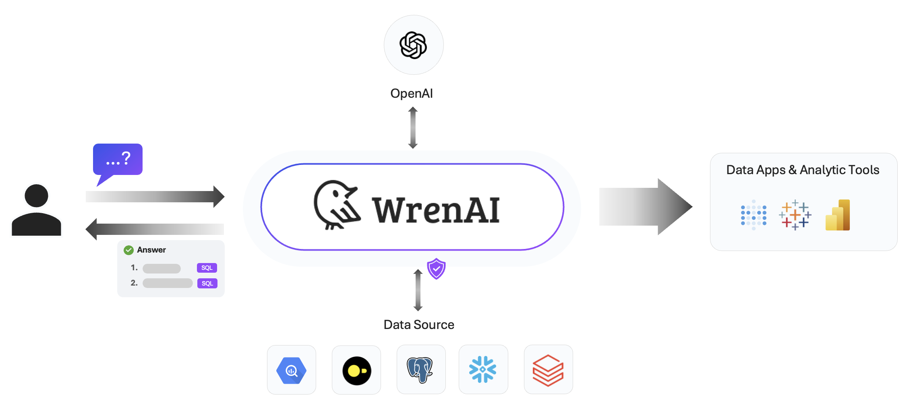

  <a href="https://getwren.ai">
    <picture>
      <source media="(prefers-color-scheme: light)" srcset="./misc/wrenai_logo.png">
      
    </picture>
    <h1 align="center">WrenAI</h1>
  </a>

  
<<<<<<< HEAD
  <a aria-label="Releases" href="https://github.com/canner/WrenAI/releases">
=======
  <a aria-label="NPM version" href="https://github.com/canner/WrenAI/releases">
>>>>>>> ce26c2b (add readme)
    
  </a>
  
  
<<<<<<< HEAD
  <a aria-label="Follow us" href="https://x.com/getwrenai">
    
=======
  <a aria-label="Follow us" href="https://x.com/wrenai">
    
>>>>>>> ce26c2b (add readme)
  </a>

> WrenAI is ***your AI data assistant*** that helps you get results and insights faster by asking questions without writing SQL.

## 🎯 Our Mission

WrenAI is dedicated to reimagining how businesses can interact with and leverage their data through LLM, by bringing comprehension capabilities to small and large data teams.

## 🤔 Benefits using WrenAI

WrenAI leverages Large Language Models (LLM) with Retrieval-Augmented Generation (RAG) technology to enhance comprehension of internal data.  Below are the three key benefits:

### 1. Fast Onboarding

> Discover and analyze your data with our user interface. Effortlessly generate results without needing to code.

### 2. Secure By Design

> Your database contents will never be transmitted to the LLM. Only metadata, like schemas, documentation, and queries, will be used in semantic search.

### 3. Open-Source

> Deploy WrenAI anywhere you like on your own data, LLM APIs, and environment, it's free.

## 🤖 WrenAI's Architecture

WrenAI is consist of three core services:

- ***Wren UI:*** An intuitive user interface for asking questions, defining data relationships, and integrating data sources within WrenAI's framework.

- ***Wren AI Service:*** Processes queries using a vector database for context retrieval, guiding LLMs to produce precise SQL outputs.

- ***Wren Engine:*** Serves as the platform's backbone, managing metadata and connecting to data sources, while preparing for future application integrations.

## 🫣 Sneak Peek

|  Data Modeling   | Ask and Follow-up Questions  |
|  ----  | ----  |
|   |  |

## 🤞 Design Philosophies

We have some core design philosophies that were used when developing WrenAI.

- **Explainability**: WrenAI ensures that every SQL query generated in natural language is accurate, concise, and reliable.
- **Interoperability**: WrenAI enables users to query data from multiple sources without dealing with the complexities of different data formats and dialects, providing a standard interface across different sources.
- **Interactive Experience**: WrenAI is designed to engage users in a dialogue, clarifying their queries and refining results in real time.
- **Continuous Learning**: WrenAI will proactively learn through ongoing query history, feedback, and interactions. Incorporating new patterns, information, and data structures into our LLM knowledge base.

## 🚧 Project Status

WrenAI is currently in ***alpha version***. The project team is actively working on progress and aiming to release new versions at least biweekly.

## 🚀 Getting Started

Using WrenAI is super simple, you can setup within 3 minutes, and start to interact with your own data!

***Start Today And Be 100X More Productive Than Yesterday***

<<<<<<< HEAD
- Visit our [Installation Guide of WrenAI](http://docs.getwren.ai/installation).
- Visit the [Usage Guides](http://docs.getwren.ai/guide/connect/overview) to learn more about how to use WrenAI.
=======
- Visit our [Installation Guide of WrenAI](https://docs.getwren.ai/).
- Visit the [Usage Guides](https://docs.getwren.ai/) to learn more about how to use WrenAI.
>>>>>>> ce26c2b (add readme)

## 📚 Documentation

Visit [WrenAI documentation](https://docs.getwren.ai) to view the full documentation.

## ⭐️ Community

- Welcome to our [Discord server](https://discord.gg/5DvshJqG8Z) to give us feedback!
- If there is any issues, please visit [Github Issues](https://github.com/Canner/WrenAI/issues).

<<<<<<< HEAD
Do note that our [Code of Conduct](./CODE_OF_CONDUCT.md) applies to all WrenAI community channels. Users are **highly encouraged** to read and adhere to them to avoid repercussions.
=======
Do note that our [Code of Conduct](https://github.com/canner/WrenAI/blob/canary/CODE_OF_CONDUCT.md) applies to all WrenAI community channels. Users are **highly encouraged** to read and adhere to them to avoid repercussions.
>>>>>>> ce26c2b (add readme)
