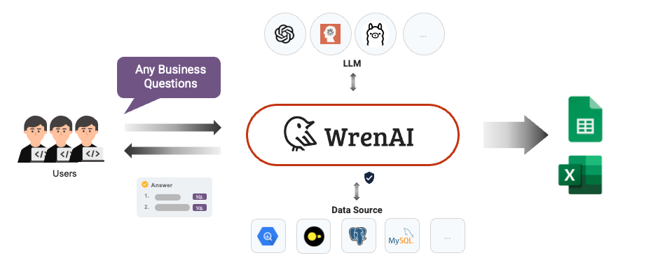
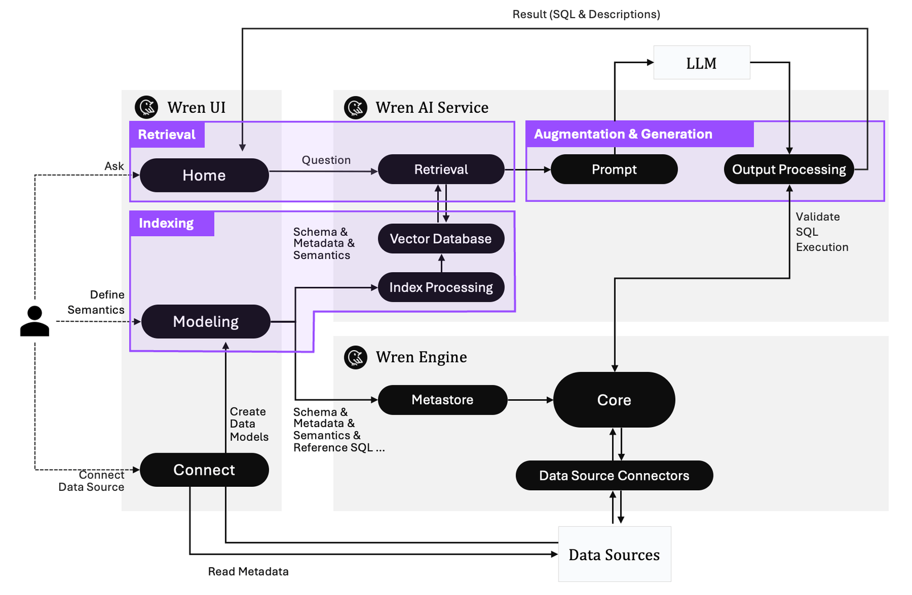

  <a href="https://getwren.ai/?utm_source=github&utm_medium=title&utm_campaign=readme">
    <picture>
      <source media="(prefers-color-scheme: light)" srcset="./misc/wrenai_logo.png">
      
    </picture>
    <h1 align="center">Wren AI</h1>
  </a>

  
  
  
  
  

🤘 Our first Product Hunt launch! We need your support on Product Hunt! 🥺

> Wren AI is a **SQL AI Agent** for data teams to get results and insights faster by asking business questions without writing SQL.

## 🕶 Try it yourself!

https://github.com/user-attachments/assets/737bbf1f-f9f0-483b-afb3-2c622c9b91ba

👉 [Start and try with your data!](https://getwren.ai/?utm_source=github&utm_medium=content&utm_campaign=readme)

## 🎯 Our Vision & Mission

Wren AI’s mission is to democratize data by bringing AI Agent with SQL ability to any data source.

🤩 [About our Vision](https://www.getwren.ai/post/the-new-wave-of-composable-data-systems-and-the-interface-to-llm-agents)

🙌 [About our Mission](https://www.getwren.ai/post/4-key-technical-challenges-using-rag-with-llms-to-query-database-text-to-sql-and-how-to-solve-it)

## 🤖 SQL AI Agent on your data

### 1. Indexing With Semantics

> Wren AI has implemented a [semantic engine architecture](https://www.getwren.ai/post/how-we-design-our-semantic-engine-for-llms-the-backbone-of-the-semantic-layer-for-llm-architecture) to provide the LLM context of your business; you can easily establish a logical presentation layer on your data schema that helps LLM learn more about your business context.

### 2. Generate SQL Queries With Context

> With Wren AI, you can process metadata, schema, terminology, data relationships, and the logic behind calculations and aggregations with [“Modeling Definition Language”](https://docs.getwren.ai/oss/engine/concept/what_is_mdl), reducing duplicate coding and simplifying data joins.

### 3. Get Insights Without Writing Code

> When starting a new conversation in Wren AI, your question is used to find the most relevant tables. From these, LLM generates three relevant questions for the user to choose from. You can also ask follow-up questions to get deeper insights.

### 4. Self-Learning Feedback Loop (Coming Soon)

> The AI self-learning feedback loop is designed to refine SQL augmentation and generation by collecting data from various sources. These include user query history, revision intentions, feedback, schema patterns, semantics enhancement, and query frequency.

## 🤔 Why Wren AI?

We focus on providing an open, secure, and reliable SQL AI Agent for everyone.

### 1. Turnkey Solution

> Wren AI makes it easy to onboard your data. Discover and analyze your data with our user interface. Effortlessly generate results without needing to code.

### 2. Secure By Design

> Your database contents will never be transmitted to the LLM. Only metadata, like schemas, documentation, and queries, will be used in semantic search.

### 3. Open-Source

> Deploy Wren AI anywhere you like on your own data, LLM APIs, and environment, it's free.

## 🤖 Wren AI Agentic Architecture

Wren AI consists of three core services:

- ***[Wren UI](https://github.com/Canner/WrenAI/tree/main/wren-ui):*** An intuitive user interface for asking questions, defining data relationships, and integrating data sources within Wren AI's framework.

- ***[Wren AI Service](https://github.com/Canner/WrenAI/tree/main/wren-ai-service):*** Processes queries using a vector database for context retrieval, guiding LLMs to produce precise SQL outputs.

- ***[Wren Engine](https://github.com/Canner/wren-engine):*** Serves as the semantic engine, mapping business terms to data sources, defining relationships, and incorporating predefined calculations and aggregations.

## ❤️ Knowledge Sharing From Wren AI

Want to get our latest sharing? [Follow our blog!](https://www.getwren.ai/blog)

### Trends
- [Can AI Solve Data Silos Challenge? New Challenges To The Multi-AI Agents Era.](https://www.getwren.ai/post/can-ai-solve-data-silos-challenge-new-challenges-to-the-multi-ai-agents-era)
- [The new wave of Composable Data Systems and the Interface to LLM agents](https://www.getwren.ai/post/the-new-wave-of-composable-data-systems-and-the-interface-to-llm-agents)
- [How do you use LangChain to build a Text-to-SQL solution? What are the challenges? How to solve it?](https://www.getwren.ai/post/how-do-you-use-langchain-to-build-a-text-to-sql-solution-what-are-the-challenges-how-to-solve-it)
- [Deep dive into how Pinterest built its Text-to-SQL solution.](https://www.getwren.ai/post/deep-dive-into-how-pinterest-built-its-text-to-sql-solution)
- [How Snowflake building the most powerful SQL LLM in the world](https://www.getwren.ai/post/how-snowflake-building-the-most-powerful-sql-llm-in-the-world)

### Architecture
- [How do we rewrite Wren AI LLM Service to support 1500+ concurrent users online?](https://www.getwren.ai/post/how-do-we-rewrite-wren-ai-llm-service-to-support-1500-concurrent-users-online)
- [Top 4 Challenges using RAG with LLMs to Query Database (Text-to-SQL) and how to solve it.](https://www.getwren.ai/post/4-key-technical-challenges-using-rag-with-llms-to-query-database-text-to-sql-and-how-to-solve-it)
- [How we design our semantic engine for LLMs? The backbone of the semantic layer for LLM architecture.](https://www.getwren.ai/post/how-we-design-our-semantic-engine-for-llms-the-backbone-of-the-semantic-layer-for-llm-architecture)

### Tutorials
- [Using RAG Architecture to query databases, export to Google Sheets, and visualize in Looker Studio.](https://www.getwren.ai/post/using-rag-architecture-to-query-databases-export-to-google-sheets-and-visualize-in-looker-studio)
- [Easily query your database using LLMs without writing SQL and then import the data into Microsoft Excel.](https://www.getwren.ai/post/easily-query-your-database-using-llms-without-writing-sql-and-then-import-the-data-into-microsoft-excel)
- [Wren AI in Kubernetes: Text-to-SQL](https://blog.getwren.ai/wren-ai-in-kubernetes-text-to-sql-39b82bda3d34)
- [How to use Meta Llama 3 to query MySQL database using Ollama and Wren AI](https://www.getwren.ai/post/how-to-use-meta-llama-3-to-query-mysql-database-using-ollama-and-wren-ai)
- [How do you use OpenAI GPT-4o to query your database?](https://www.getwren.ai/post/how-to-use-openai-gpt-4o-to-query-your-database)
- [How to directly access 150k+ Hugging Face Datasets with DuckDB and query using GPT-4o](https://www.getwren.ai/post/how-to-directly-access-150k-hugging-face-datasets-with-duckdb-and-query-using-gpt-4o)

## 🚧 Project Status

Wren AI is currently in ***Beta Version***. The project team is actively working on progress and aiming to release new versions at least biweekly.

## 🚀 Getting Started

Using Wren AI is super simple, you can setup within 3 minutes, and start to interact with your own data!

- Visit our [Installation Guide of Wren AI](http://docs.getwren.ai/oss/installation).
- Visit the [Usage Guides](https://docs.getwren.ai/oss/guide/connect/overview) to learn more about how to use Wren AI.

## 📚 Documentation

Visit [Wren AI documentation](https://docs.getwren.ai/oss/overview/introduction) to view the full documentation.

## ⭐️ Community

- Welcome to our [Discord server](https://discord.gg/5DvshJqG8Z) to give us feedback!
- If there is any issues, please visit [GitHub Issues](https://github.com/Canner/WrenAI/issues).

Do note that our [Code of Conduct](./CODE_OF_CONDUCT.md) applies to all Wren AI community channels. Users are **highly encouraged** to read and adhere to them to avoid repercussions.
