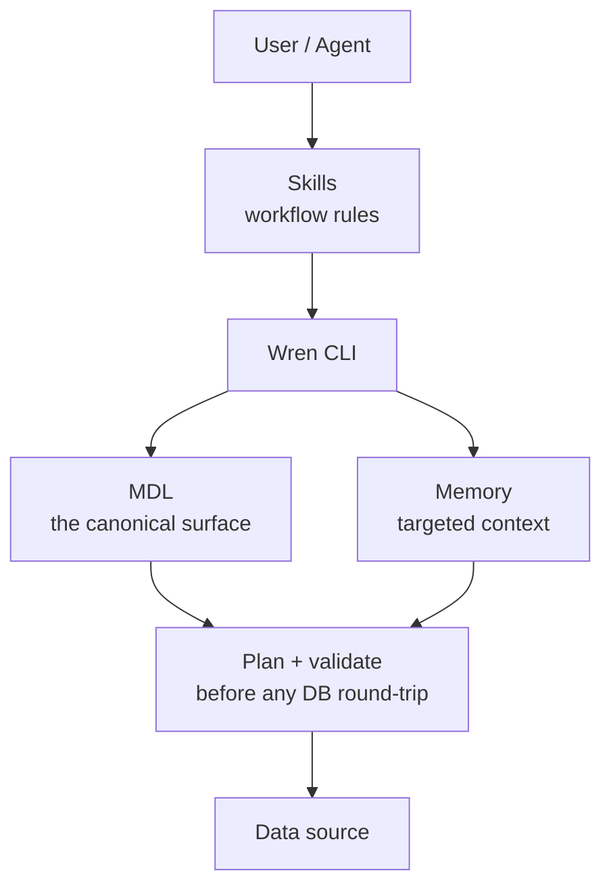

# How does Wren AI keep agents from hallucinating?

Hallucinations on business data are rarely a "model is bad at SQL" problem. They are a missing-context problem — the agent writes a confident-looking query against data it does not actually understand.

Wren AI's architecture is designed to **give the agent the context it needs at every step**, and to **fail loudly when the agent guesses**. Here is how the pieces fit.

## The shape of the system



Five layers sit between the agent's question and the database:

| Layer | What it does | How it prevents hallucination |
|---|---|---|
| **Skills** | Encode the workflow the agent must follow | The agent cannot skip "check memory" or "validate before execute" |
| **MDL** | Declare every table, column, and relationship the agent is allowed to use | The agent can only name modeled objects — undeclared columns and legacy tables are invisible |
| **Memory** | Index MDL + instructions + past NL-SQL pairs; retrieve only what matters per question | The agent reads the relevant slice, not a generic schema dump |
| **Plan + validate** | Expand modeled SQL into the exact SQL that will run, before any DB call | Bad references fail at plan time with a clear error, not silently in production |
| **Connectors** | Execute the planned SQL against the source | Type, dialect, and permission checks happen here |

## What each layer blocks

### MDL: the agent cannot name what is not modeled

Raw warehouses give the agent ambiguous joins, near-duplicate tables (`customers` vs `customers_v3` vs `loyalty_v3`), and columns that overlap across schemas. MDL collapses those problems into one canonical surface.

If `email` is not in the `customers` model, the agent cannot query it — it does not exist in Wren AI's view of your data. If the canonical join between `orders` and `customers` is declared once in MDL, the agent does not have to invent it.

### Memory: targeted retrieval beats dumping the schema

Two common failure modes:

- **Dump the whole schema** into the prompt → the model gets confused by irrelevant tables.
- **Let the model guess** which tables are relevant → it picks the wrong one.

Memory does neither. It indexes MDL + `instructions.md` + confirmed NL-SQL pairs, and retrieves only the slice that matches the question. The agent reads `customers`, `orders`, and the approved revenue calculation — not 500 tables.

### Plan + validate: errors fail visibly

`wren dry-plan` takes the agent's modeled SQL and expands it into the exact SQL that will run against the database. The agent — and you — see:

- Catalog and schema resolution
- Relationship joins inlined as CTEs
- Policy filters from `instructions.md` injected
- Column-level access enforced

If a column name is wrong, dry-plan returns the available columns. If a relationship is missing, it says so. The agent retries with the right info instead of running broken SQL and reporting a wrong number.

### Skills: the workflow is not the agent's to invent

Skills are Markdown workflow guides. They tell the agent the order of operations: check memory first, then write SQL against MDL, then dry-plan, then execute, then store the confirmed pair. The agent does not get to skip steps.

This matters because the most common failure mode is "model is fine, but the workflow around it is missing." Skills ship that workflow.

## What the agent sees

For a question like "top 5 customers by lifetime value this quarter", the loop runs:

```text
1. wren memory recall  -q "top customers by revenue"
   → returns 2 similar past NL-SQL pairs

2. wren memory fetch    -q "customer lifetime value"
   → returns customers model + customer_lifetime_value column + active-customer instruction

3. agent writes SQL against MDL:
   SELECT first_name, customer_lifetime_value
   FROM customers
   ORDER BY 2 DESC LIMIT 5;

4. wren dry-plan
   → expands to planned SQL with the active-customer filter injected

5. wren --sql ...
   → executes against the database

6. wren memory store --nl "..." --sql "..."
   → next similar question gets this as a recall
```

Every step is a primitive the agent calls. The trace stays in the agent's reasoning where you review its work — there is no separate "correctness dashboard" you have to trust.

## See also

- [Architecture](/oss/reference/architecture) — the full technical breakdown
- [How does the agent learn from your context?](/oss/concepts/agent_learning) — the memory + skills loop
- [What does MDL do for the agent?](/oss/concepts/what_is_mdl) — why MDL is the canonical surface
