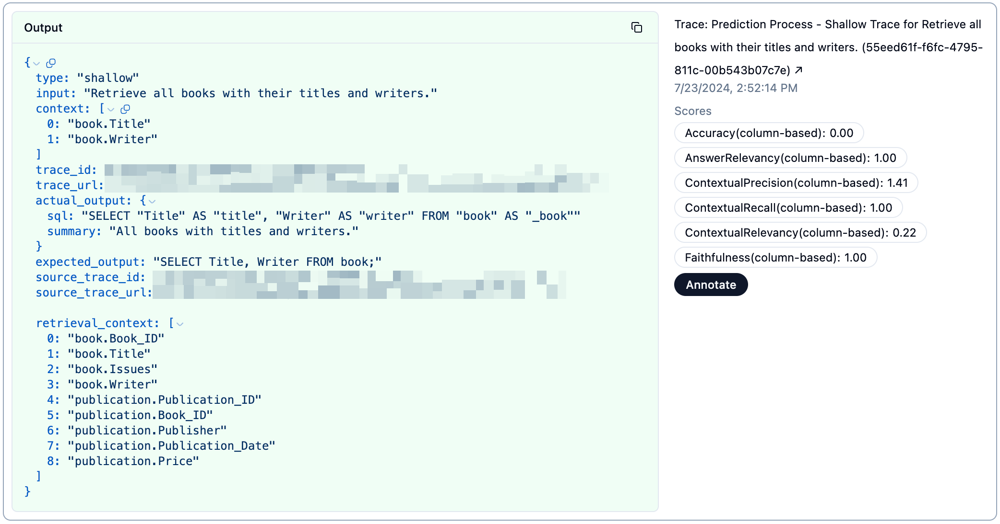

# Evaluation Framework

This document describes the evaluation framework for the Wren AI service. The evaluation framework is designed to assess the performance of the Wren AI service based on the following components:

## Requirements

- Install [Just](https://github.com/casey/just?tab=readme-ov-file#packages) to run the evaluation framework commands.
- Set up the [Langfuse](https://cloud.langfuse.com) account and get the API key and secret. Fill in the `.env.dev` file with the key and secret.
- Execute `just up` to start the necessary development services.

## Dataset Curation

The dataset curation process is used to prepare the evaluation dataset for the Wren AI service on evaluation purpose. You can follow the steps below to start the curation app:

- copy `.env.example` to `.env` and fill in the environment variables
- execute the command under the `wren-ai-service` folder: `just curate_eval_data`

## Eval Dataset Preparation(If using Spider 1.0 dataset)

```cli
just prep
```

This command will do two things:
1. download Spider 1.0 dataset in `wren-ai-service/tools/dev/spider1.0`; and there are two folders inside: database and spider_data
    - database: it contains test data. It's downloaded from [this repo](https://github.com/taoyds/test-suite-sql-eval).
    - spider_data: it contains table schema, ground truths(question sql pairs), etc. For more information, please refer to [this repo](https://github.com/taoyds/spider).
2. prepare evaluation dataset and put them in `wren-ai-service/eval/dataset`. File name of eval dataset for Spider would look like this: `spider_<db_name>_eval_dataset.toml`

## Evaluation Dataset Schema

- dataset_id(UUID)
- date
- mdl
- eval dataset

## Prediction Process

The prediction process is used to produce the results of the evaluation data using the Wren AI service. It will create traces and a session on Langfuse to make the results available to the user. You can use the following command to predict the evaluation dataset under the `eval/dataset` directory:

```cli
just predict <evaluation-dataset>
```

Also, sub-pipeline predictions are supported by specifying the pipeline name:

```cli
just predict <evaluation-dataset> <pipeline-name>
```

Currently, we support the following pipelines: 'ask', 'generation', and 'retrieval'. If no pipeline name is specified, the default is the 'ask' pipeline.

## Evaluation Process

The evaluation process is used to assess the prediction results of the Wren AI service. It compares the prediction results with the ground truth and calculates the evaluation metrics. This process will also add a trace in the same session on Langfuse to make the evaluation results available to the user. You can use the following command to evaluate the prediction results under the `outputs/predictions` directory:

```cli
just eval <prediction-result>
```

Note: If you would like to enable semantics comparison between SQLs by LLM in order to improve the accuracy metric, please fill in Open AI API key in `.env` file in `wren-ai-service/eval` and add `--semantics` to the end of the command like following:

```cli
just eval <prediction-result> --semantics
```

The evaluation results will be presented on Langfuse as follows:



## Terms

This section describes the terms used in the evaluation framework:

- **input**: The user query used as input to the Wren AI service (e.g., "What is the total number of COVID-19 cases in the US?").
- **actual_output**: The actual SQL query generated to retrieve the answer to the user query (e.g., "SELECT SUM(cases) FROM covid19 WHERE country='US'").
- **expected_output**: The expected SQL query that should retrieve the answer to the user query (e.g., "SELECT SUM(cases) FROM covid19 WHERE country='US'").
- **retrieval_context**: The relevant context that helps the LLM generate the SQL query (e.g., "covid19.country", "covid19.cases").
- **context**: The relevant context that aligns with human expectations to generate the SQL query (e.g., "covid19.country", "covid19.cases").

## Metrics

This section describes the evaluation metrics used in the evaluation framework:

- **Accuracy**: This metrics is defined as the proportion of the correct SQL output generated by the model compared to the expected SQL output. It checks if the generated SQL query produces the correct results.
- **Answer Relevancy**: This metric helps determine how well your LLM generates relevant information based on the input it receives. It ensures the efficiency and accuracy of the model's output.
- **Faithfulness**: This metric helps determine how well your LLM generates information that is factually correct and aligned with the retrieval context, minimizing hallucinations and contradictions.
- **Contextual Relevancy**: This metric helps determine how well your retriever minimizes irrelevant information while maximizing the retrieval of relevant information. It ensures the efficiency and accuracy of the retrieval process.
- **Contextual Recall**: This metric helps determine how well the embedding model identifies and retrieves relevant information based on the given context.
- **Contextual Precision**: This metric helps determine how well the reranker places relevant nodes higher in the ranking, ensuring that users get the most pertinent results quickly.
